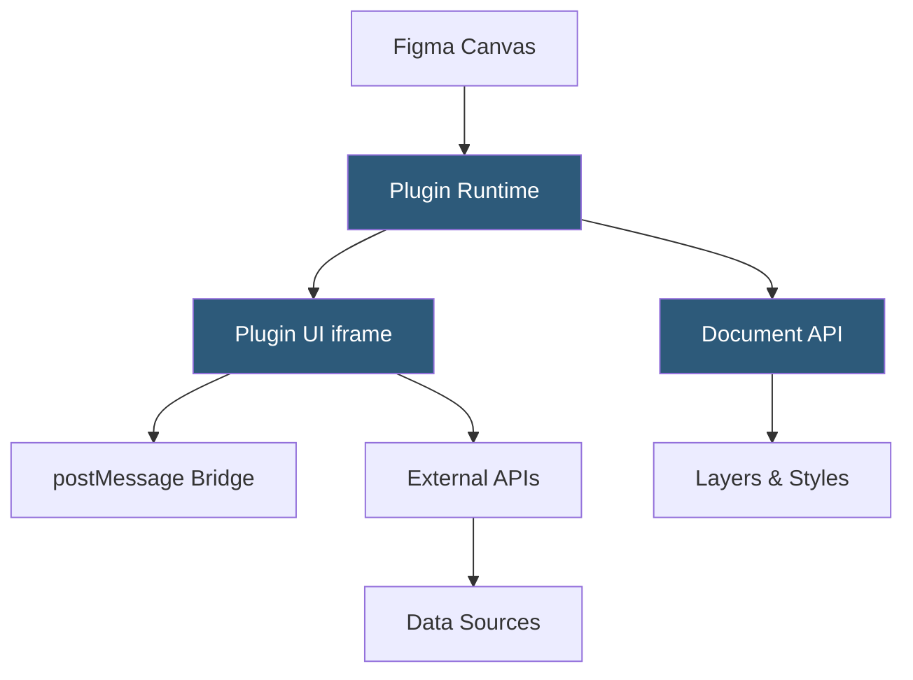

**Category:** UI/UX Design Platforms
**Difficulty:** Intermediate
**Reading time:** 6 min read

---

The Figma Plugins Ecosystem is a community-driven extension marketplace enabling third-party developers to build and distribute tools that extend Figma's native capabilities. Plugins automate design tasks, integrate external data sources, enhance accessibility workflows, and bridge design to development workflows.

- **Plugin API** — JavaScript API exposing read/write access to Figma's document model from within sandboxed plugin code
- **Plugin Manifest** — JSON configuration file declaring plugin metadata, permissions, and UI entry points
- **Figma Sandbox** — isolated iframe environment where plugin UI runs, communicating with canvas code via `postMessage`
- **REST API Integration** — plugins can call external REST APIs using `fetch` for data import and export
- **Plugin Manager** — Figma's in-app interface for installing, enabling, and removing plugins
- **Widgets** — persistent, stateful interactive objects placed on the FigJam canvas, built using the Widget API
- **Plugin Permissions** — explicit capabilities plugins must declare: network access, clipboard, file system

Figma plugins execute in a two-thread architecture. The main plugin code (canvas thread) has synchronous access to the Figma document API—reading and modifying layers, styles, components, and selection. The UI thread runs in a sandboxed iframe and can render HTML/CSS/JavaScript for user interfaces. Communication between threads happens via `figma.ui.postMessage()` and `window.parent.postMessage()`, an asynchronous bridge that prevents UI code from blocking the canvas.

Popular plugins span several workflow categories: data population (Tokens Studio syncing design tokens with repositories), content generation (Content Reel filling designs with realistic dummy data), accessibility checking (Stark auditing color contrast and annotations), and design-to-code handoff (Zeplin, Anima generating production-ready code). Plugins like Figma to Code or Builder.io translate Figma frames directly to React, Tailwind CSS, or HTML/CSS output.

The Widget API extends plugins to FigJam with persistent, interactive canvas objects. Unlike plugins that open and close, Widgets remain on the canvas and maintain state between sessions. A voting widget enables brainstorming sessions where participants click to upvote ideas directly on sticky notes. Widgets are built with React-like JSX syntax using Figma's `figma.widget` API.

Plugin distribution goes through Figma's Community. Publishers submit plugins with a manifest and code bundle; Figma's security review checks for prohibited behaviors (accessing local files, exfiltrating user data, executing remote code). Approved plugins appear in Community with install counts, ratings, and changelogs. Organizations can restrict which plugins team members can install through admin controls.

- Design token synchronization between Figma Variables and code repositories
- Accessibility auditing with automated WCAG color contrast checking
- Content population with realistic placeholder text, avatars, and data
- Design-to-code export generating React, Tailwind, or SwiftUI components
- Batch operations automating repetitive renaming, style application, or export tasks

| Advantage | Disadvantage |
|-----------|--------------|
| Extensible architecture covers gaps in native Figma features | Plugin code runs client-side; performance-heavy plugins slow Figma |
| Large community plugin library with thousands of tools | Quality varies; many popular plugins have poor maintenance |
| API allows deep document manipulation for automation workflows | Sandbox architecture prevents plugins from accessing local OS resources |
| Organization admin controls restrict plugin access for security | Plugin API changes can break existing plugins without warning |

- [Figma Community Resources](figma-community-resources.md)
- [Figma Design Systems](figma-design-systems.md)
- [Figma Dev Mode](figma-dev-mode.md)

---
*Part of the [UI/UX Design Platforms](index.md) category · [Back to Master Index](../../index.md)*
