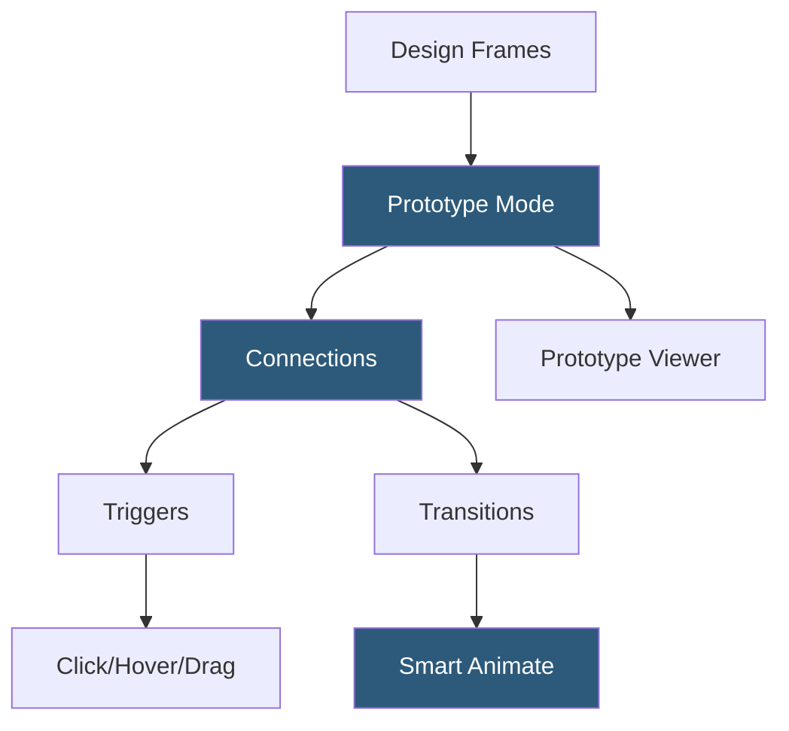

**Category:** UI/UX Design Platforms
**Difficulty:** Intermediate
**Reading time:** 6 min read

---

Figma's built-in prototyping system enables designers to create interactive, clickable flows directly from design files without exporting to external tools. It supports transitions, overlays, scrolling behaviors, and component interactions, enabling realistic user testing on actual designs.

- **Connections** — prototype links drawn between frames defining navigation flows triggered by interactions
- **Triggers** — events initiating prototype transitions: On Click, On Hover, Mouse Enter, Mouse Leave, Drag
- **Transitions** — animation types between frames: Instant, Dissolve, Smart Animate, Move In/Out, Push, Slide
- **Smart Animate** — Figma's interpolation system that matches and animates named layers between connected frames
- **Overlays** — frames displayed on top of the current frame without full navigation (modals, tooltips, dropdown menus)
- **Scrolling Frames** — fixed viewport frames with overflow content enabling vertical and horizontal scroll prototyping
- **Variables in Prototypes** — conditional logic using number, string, and boolean variables for branching prototype flows

Prototype mode is a parallel state of the Figma canvas where connections between frames are defined. Switching to Prototype mode reveals connection handles on selected elements. Dragging from a handle to a target frame creates a connection, opening a settings panel for trigger type, transition type, easing curve, and duration.

Smart Animate is the most powerful transition type. When two frames are connected with Smart Animate, Figma compares layer trees between the source and destination frames. Layers sharing the same name are treated as corresponding objects and animated between their states: a button that changes position, color, and opacity transitions smoothly between frames without keyframe definition. This enables micro-interaction design without code—a toggle switching from off to on, a card expanding to full-screen, a navigation slide-in.

Variables (introduced in Figma as a newer feature) add conditional logic. Boolean variables can control layer visibility, enabling prototype flows that branch based on state—a form with validation errors showing an error state after a submit click. Number variables can count steps in onboarding flows. Conditional interactions (`if variable == "true" then navigate to FrameX`) enable simulating real application logic within the prototype viewer.

Prototype sharing generates a public link opening the interactive prototype in Figma's viewer, where testers navigate as they would on an actual device. Figma supports device frame overlays (iPhone, Android, desktop browser) and configures the starting flow. Hotspot areas can be configured to always show as a hint overlay to guide user testing facilitators.

- Usability testing sessions with realistic interaction prototypes
- Stakeholder presentations demonstrating proposed user flows interactively
- Handoff documentation showing expected transition behavior for engineers
- A/B testing design concept variants with user panels
- Rapid validation of navigation architecture before development

| Advantage | Disadvantage |
|-----------|--------------|
| No separate tool needed; prototyping lives inside the design file | Complex branching logic is cumbersome compared to dedicated prototype tools |
| Smart Animate produces realistic micro-interactions quickly | Prototype variables limited compared to ProtoPie or Origami Studio |
| Shareable links need no special viewer software for testers | Prototype performance can lag with many concurrent Smart Animate transitions |
| Variables enable basic conditional logic without code | Not suitable for prototyping data-heavy or form-heavy interaction patterns |

- [Figma Collaborative Design](figma-collaborative-design.md)
- [ProtoPie Interaction Design](protopie-interaction-design.md)
- [Principle Animation Tool](principle-animation-tool.md)

---
*Part of the [UI/UX Design Platforms](index.md) category · [Back to Master Index](../../index.md)*
