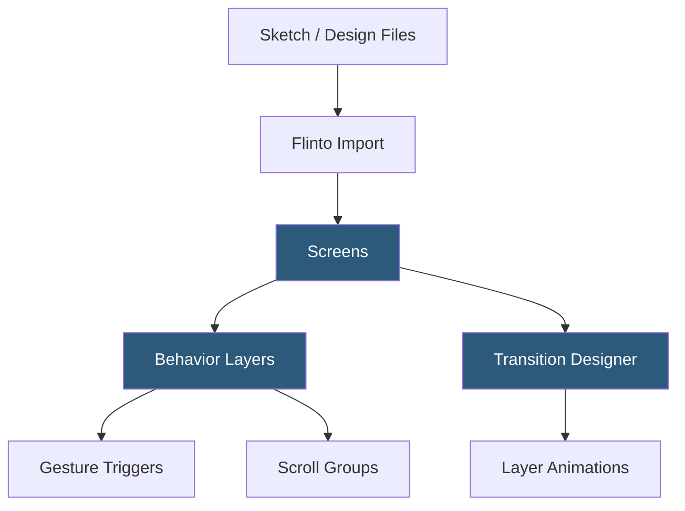

**Category:** UI/UX Design Platforms
**Difficulty:** Intermediate
**Reading time:** 5 min read

---

Flinto is a macOS prototyping tool focused on creating micro-interactions, screen transitions, and animated prototypes with a behavior-layer approach. It allows designers to add behavioral layers on top of static screen designs imported from Sketch, defining swipe gestures, scroll interactions, and custom transitions without code.

- **Behavior Layer** — a transparent layer added on top of any screen defining interactive regions and their behaviors
- **Gesture Transitions** — swipe-driven transitions between screens using velocity and distance to determine navigation
- **Scroll Groups** — scrollable content areas within screens allowing vertical and horizontal scroll simulation
- **Component** — Flinto's reusable interactive elements with behaviors that instances inherit automatically
- **Transition Designer** — dedicated mode for crafting layer-by-layer transitions between connected screens
- **Sketch Plugin** — Flinto's Sketch integration for importing Sketch artboards directly into Flinto as screens
- **Video Export** — recording prototype interactions as video files for documentation and sharing

Flinto's interaction model is built around the Behavior Layer concept. When a designer adds a behavior layer to a screen, it creates a transparent region that can respond to tap, swipe, scroll, or keyboard events. Taps trigger screen transitions; swipes can drive gesture-based navigation similar to iOS swipe-back; scroll groups enable realistic scroll behavior within a static screen.

The Transition Designer is where Flinto differentiates from simpler prototyping tools. When connecting two screens with a custom transition, the Transition Designer opens both screens side by side with matching layers highlighted. Designers can define how each layer transitions: the navigation bar might stay fixed while content slides left; a card might scale up from its position in a list to fill the screen. Each layer's transition is individually configurable with duration, delay, easing, and position/scale/opacity changes.

Components in Flinto work like interactive symbols. A tab bar component defined with behaviors (each tab navigating to the appropriate screen) is placed once and reused across all screens that share that tab bar. Updating the component updates all instances, keeping navigation behavior consistent without manually maintaining each screen.

Video export renders prototype interactions as MP4 or GIF files. This is particularly useful for sharing animation references with developers who don't have Flinto, or for including interaction details in presentations and design reviews. Flinto's screen recording captures taps and swipes as visual indicators on the video.

- iOS app interaction prototyping with native gesture feel
- Micro-interaction design for swipe, pull-to-refresh, and dismiss patterns
- Animation reference videos for developer handoff
- Card expansion and list-to-detail transition design
- Tab navigation and modal presentation interaction prototyping

| Advantage | Disadvantage |
|-----------|--------------|
| Transition Designer provides precise layer-by-layer animation control | macOS only; Windows designers cannot use Flinto |
| Gesture-driven transitions create authentic iOS-style interaction feel | No real-time collaboration; single-user design tool |
| Video export enables animation sharing without Flinto access | Import from Figma is indirect; Sketch-first workflow |
| Component system maintains consistent behavior across screen reuses | Less capable for complex conditional logic than ProtoPie or Axure |

- [Principle Animation Tool](principle-animation-tool.md)
- [ProtoPie Interaction Design](protopie-interaction-design.md)
- [Figma Prototyping](figma-prototyping.md)

---
*Part of the [UI/UX Design Platforms](index.md) category · [Back to Master Index](../../index.md)*
