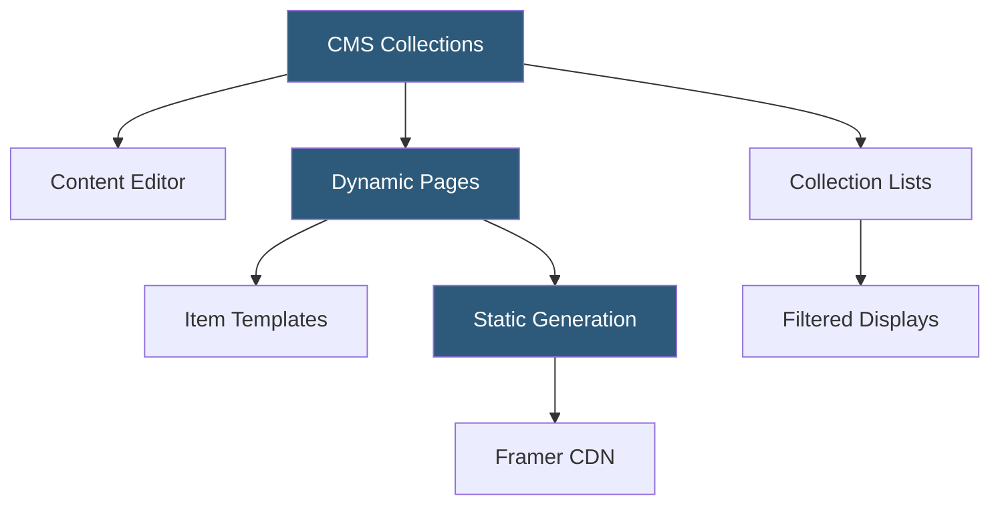

**Category:** UI/UX Design Platforms
**Difficulty:** Intermediate
**Reading time:** 5 min read

---

Framer CMS is the content management system built into the Framer website builder, enabling designers to create data-driven pages backed by structured content collections. It provides a spreadsheet-like content editor, dynamic page generation, and filtering capabilities for blogs, portfolios, team pages, and product listings.

- **Collections** — structured data tables defining fields and content types (Text, Image, Date, URL, RichText)
- **CMS Items** — individual records within a Collection (e.g., individual blog posts, team members)
- **Dynamic Pages** — Framer pages generated automatically from CMS Collection items using a template layout
- **Collection List** — Framer canvas component rendering a filtered and sorted subset of a Collection
- **Slug Field** — URL-path identifier for each CMS item used in dynamic page routing
- **Content Editor** — spreadsheet-style CMS dashboard for adding and editing items without design access
- **Localization** — per-item locale-specific content fields for multilingual CMS content

Framer CMS is configured in the Collections panel of the Framer designer. Designers define a Collection by naming it and adding typed fields—a Blog collection might have Title (Text), Date (Date), Cover (Image), Category (Text), Body (RichText), and Slug (Text) fields. Once defined, items are entered through a spreadsheet-style editor panel.

Dynamic Pages are created by linking a Framer page to a Collection. The page template is designed once and uses CMS binding to map design elements to collection fields. A heading text element bound to the Title field automatically displays the corresponding title for each item's page. Framer generates one static page per CMS item at build time using ISR. Items added or modified after publishing trigger background regeneration of affected pages without a full site rebuild.

Collection Lists bring sets of CMS items onto any canvas page. The designer creates a list component, connects it to a Collection, configures filters (Category equals "Design", Date is after January 2025) and sorting (newest first), and designs the individual item template card. The list renders the configured number of items at runtime, enabling blog index pages, portfolio grids, and team directories driven entirely by CMS data.

The Content Editor is a non-designer-facing interface for content management. Non-technical team members add blog posts, update team members, or modify product listings without accessing the design canvas. Changes propagate to the live site after publishing. Framer CMS does not currently support external CMS sources (Contentful, Sanity) natively—all content must be managed within Framer's own CMS, which is a key limitation compared to headless CMS setups.

- Blog pages with CMS-managed posts and design-consistent templates
- Portfolio sites with dynamically generated case study pages
- Team member directories with individual profile pages
- Product or services catalogs with filterable category pages
- Press/media pages with company news items

| Advantage | Disadvantage |
|-----------|--------------|
| CMS configuration is native within the design tool | Limited to Framer's own CMS; no headless CMS integration |
| Non-technical editors update content without design access | Fewer content field types than dedicated CMS platforms |
| Static generation at build time ensures fast page loads | Content editor is basic compared to WordPress or Contentful |
| Collection filtering and sorting in the canvas designer | API access to CMS content requires custom development |

- [Framer Website Builder](framer-website-builder.md)
- [Framer Interactive Design](framer-interactive-design.md)
- [Framer Motion Animations](framer-motion-animations.md)

---
*Part of the [UI/UX Design Platforms](index.md) category · [Back to Master Index](../../index.md)*
