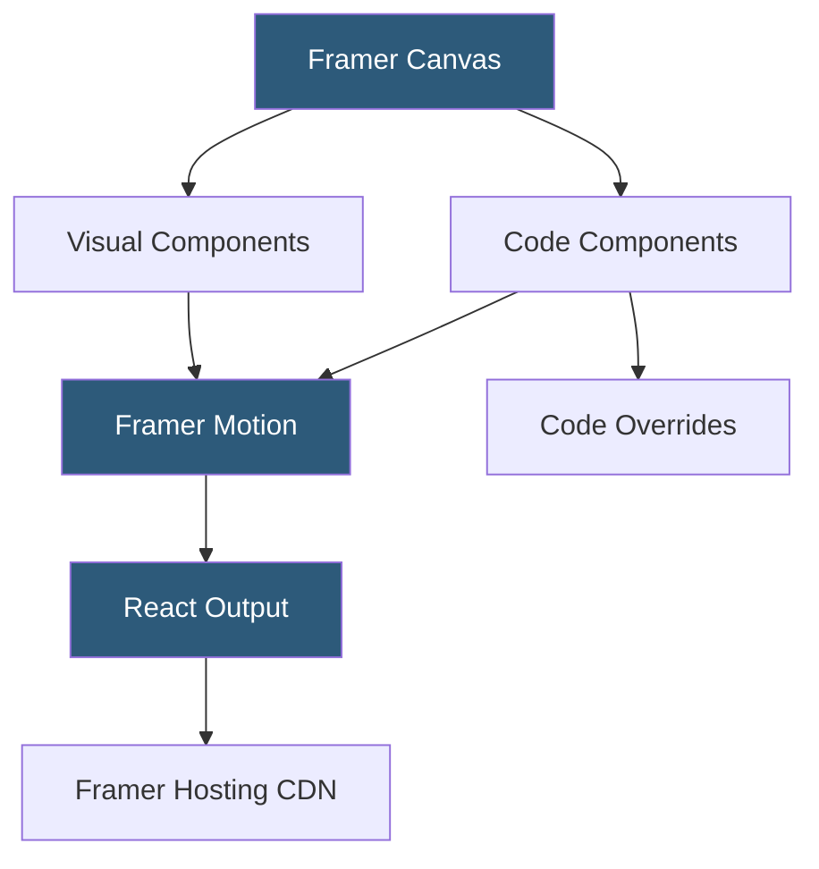

**Category:** UI/UX Design Platforms
**Difficulty:** Advanced
**Reading time:** 7 min read

---

Framer is a design tool that generates real React code from visual designs, positioning itself at the intersection of design and development. It supports advanced interaction design through Framer Motion, component properties, and code overrides, enabling designers and developers to collaborate in a shared medium that produces production-deployable websites.

- **Code Components** — React components written directly in Framer's code editor and used on the design canvas
- **Visual Components** — non-code design components with exposed property controls for configuration
- **Framer Motion** — animation library providing physics-based springs, keyframes, and gesture responses
- **Code Overrides** — JavaScript/TypeScript functions applied to visual components to add dynamic behavior
- **Breakpoints** — responsive layout breakpoints enabling desktop, tablet, and mobile layout variants
- **Smart Components** — interactive Framer components with built-in state machines for multi-state behaviors
- **Component Store** — Framer's marketplace of third-party components installable directly into designs

Framer's canvas is a React-tree visualizer. Every element placed on the canvas becomes a JSX node in the component hierarchy. Visual edits translate to React props and CSS-in-JS styles. When users publish, Framer compiles the design tree to optimized React with Server-Side Rendering capabilities, hosted on Framer's CDN.

Code Components are full React components written in TypeScript within Framer's integrated Monaco code editor. They accept `addPropertyControls` definitions that expose configuration panels in the design canvas—a Code Component for a gradient card can expose color picker controls usable by non-developers. This bridges the gap between design and code: developers write flexible components, designers configure them visually.

Code Overrides attach behavior to visual components without modifying them. An override is a higher-order function accepting a component and returning an enhanced version with additional props. Overrides are written in TypeScript and can use Framer Motion hooks (`useAnimation`, `useMotionValue`, `useTransform`) to create scroll-driven animations, drag interactions, or data-fetched content updates. This pattern keeps the design file clean while enabling complex runtime behavior.

Smart Components use Framer's variant and interaction system to model state transitions. A navigation menu Smart Component can have Closed and Open variants with defined hover and tap triggers transitioning between them using spring animations. Non-developer designers can configure Smart Components without writing code, while developers can extend them with Code Overrides for data binding.

- Design engineers building production marketing sites that ship React code
- Interaction designers creating advanced physics-based micro-interaction prototypes
- Teams where designers and developers share a single tool rather than handoff files
- SaaS companies building conversion-optimized landing pages with scroll animations
- Agencies delivering animated creative websites that go beyond static designs

| Advantage | Disadvantage |
|-----------|--------------|
| Produces real React code deployable to production | High learning curve; requires React/JavaScript understanding for advanced use |
| Framer Motion enables best-in-class web animations visually | Platform lock-in; exported code is Framer-context dependent |
| Code Components and overrides enable design-development collaboration | More expensive than simpler design tools for basic use cases |
| Component Store extends capabilities without writing code from scratch | Less suitable for pure wireframing or early-stage design exploration |

- [Framer Motion Animations](framer-motion-animations.md)
- [Figma Prototyping](figma-prototyping.md)
- [ProtoPie Interaction Design](protopie-interaction-design.md)

---
*Part of the [UI/UX Design Platforms](index.md) category · [Back to Master Index](../../index.md)*
