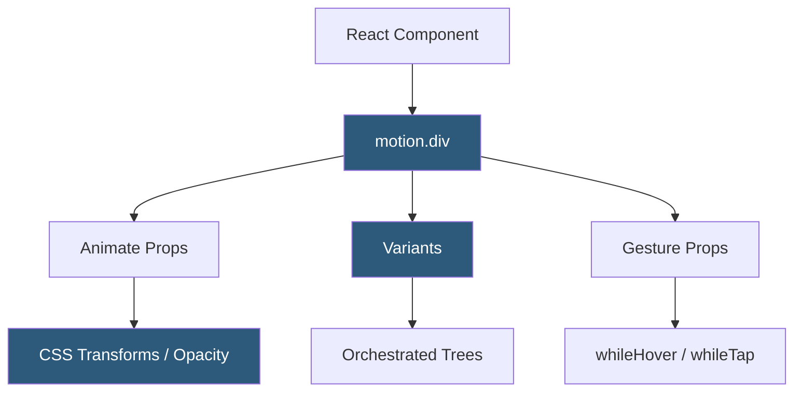

**Category:** UI/UX Design Platforms
**Difficulty:** Advanced
**Reading time:** 7 min read

---

Framer Motion is an open-source React animation library providing declarative APIs for keyframe animations, gesture-based interactions, physics-based springs, and scroll-driven effects. It is the rendering engine underlying all animations in Framer's design tool and is widely used independently in production React applications.

- **motion Components** — Framer Motion's enhanced HTML/SVG components (`motion.div`, `motion.svg`) accepting animation props
- **Variants** — named animation state objects enabling coordinated, orchestrated animation sequences across component trees
- **AnimatePresence** — component wrapper enabling exit animations for elements being removed from the React tree
- **useMotionValue** — reactive value hook enabling physics simulation and gesture tracking independent of React's render cycle
- **useTransform** — transform hook mapping one MotionValue to another for scroll-linked animations
- **Gesture Props** — `whileHover`, `whileTap`, `whileDrag` props enabling state-driven interaction animations
- **Layout Animations** — automatic animations of layout changes between renders using `layout` prop

Framer Motion wraps HTML elements in motion components that intercept the `animate` prop. When `animate` values differ from `initial` values, Framer Motion triggers an animation using its internal animation engine, which runs on the Web Animations API (WAAPI) for hardware-accelerated transforms (translate, scale, rotate, opacity) and falls back to JavaScript-driven RAF loops for values the browser cannot accelerate (colors, layout properties).

Variants enable coordinated tree animations. A parent `motion.div` with `variants={{ hidden: {...}, visible: {...} }}` propagates its state to all descendant `motion` elements that declare matching variant keys. Setting `animate="visible"` on the parent triggers a cascaded animation through the tree. The `staggerChildren` transition property delays each child's start time sequentially, creating stagger entrance effects without manual delay calculations.

AnimatePresence is the mechanism for exit animations. Standard React unmounts components immediately, before any leaving animation can run. AnimatePresence defers unmounting until the `exit` animation completes. This is how notification toasts, modals, and page transitions animate out—wrapping them in AnimatePresence with `exit` variants enables smooth removals.

MotionValues and useTransform enable scroll-driven animations. `useScroll` returns `scrollY` as a MotionValue. `useTransform(scrollY, [0, 300], [1, 0])` maps a 0-300px scroll range to an opacity of 1-0, creating a parallax fade effect. All MotionValue operations run in a `requestAnimationFrame` loop outside React's render cycle, ensuring high-performance animations without triggering component re-renders.

- Entrance animations for content sections as they scroll into view
- Drag-and-drop interfaces with gesture-based physics interactions
- Page transitions in Next.js and React Router applications
- Modal and notification enter/exit animations with AnimatePresence
- Data visualization charts animated as they render for engagement

| Advantage | Disadvantage |
|-----------|--------------|
| Declarative API reduces animation complexity compared to CSS keyframes | JavaScript-driven animations for non-transform properties impact performance |
| WAAPI acceleration ensures 60fps for transform animations | Bundle size addition (35kb+ gzipped) may concern performance-critical applications |
| Variants enable complex orchestrated animations with minimal code | Learning curve for MotionValues and composition patterns |
| Layout animations handle complex reflow animations automatically | AnimatePresence patterns require careful React key management |

- [Framer Interactive Design](framer-interactive-design.md)
- [Framer Website Builder](framer-website-builder.md)
- [Principle Animation Tool](principle-animation-tool.md)

---
*Part of the [UI/UX Design Platforms](index.md) category · [Back to Master Index](../../index.md)*
