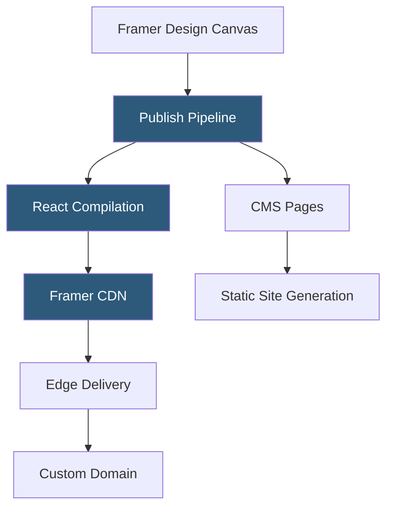

**Category:** UI/UX Design Platforms
**Difficulty:** Intermediate
**Reading time:** 6 min read

---

Framer's website builder extends the Framer design tool into a full no-code/low-code publishing platform, enabling designers to deploy production React-based websites directly from the Framer canvas without a separate development workflow. It combines Framer's visual editor with hosting, CMS, and domain management in a single platform.

- **Framer Sites** — deployed websites generated from Framer designs and hosted on Framer's global CDN
- **Publish Workflow** — one-click publishing that compiles the design canvas to optimized React and deploys to CDN
- **Responsive Breakpoints** — configurable breakpoints (desktop, tablet, mobile) with independent layout control
- **SEO Settings** — per-page metadata, Open Graph images, and sitemap configuration within the designer
- **Custom Domain** — CNAME or A record configuration connecting custom domains to Framer-hosted sites
- **Analytics Integration** — direct integration with Google Analytics and custom script injection
- **Localization** — Framer's multi-language site support with locale-specific content and URL routing

Publishing in Framer triggers a compile-and-deploy pipeline. The Framer canvas JSON design tree is compiled to React components with associated CSS-in-JS styles. Static pages are server-side rendered using React's SSR capabilities, generating HTML files for fast initial loads. Dynamic CMS pages are pre-generated at build time using Incremental Static Regeneration (ISR), enabling content updates without full rebuilds.

The deploy pipeline packages the compiled React output and deploys it to Framer's CDN edge network, which distributes assets globally. Domain configuration connects via DNS records (CNAME for Framer's managed subdomains or A record for apex domains). HTTPS is automatically provisioned through Let's Encrypt certificates managed by Framer.

Responsive breakpoints in Framer give designers explicit control at each viewport width. Unlike CSS media queries that inherit from parent breakpoints, Framer's breakpoint system allows completely independent layouts at each size—a desktop two-column grid doesn't need to "cascade" its styles to tablet; the tablet layout is designed independently. This gives more precise control but requires more design work.

SEO configuration is exposed through a per-page settings panel where designers set `<title>`, meta descriptions, canonical URLs, and Open Graph images. Sitemap generation is automatic, including all published pages. Script injection panels allow adding analytics tags, chat widgets, or custom JavaScript without code access.

- Startups shipping marketing sites from design to production in hours
- Design agencies delivering client websites that remain editable by non-developers
- SaaS product teams maintaining marketing and documentation sites in Framer
- Freelancers offering designed-and-hosted website packages to clients
- Designers building personal portfolio sites with advanced animations

| Advantage | Disadvantage |
|-----------|--------------|
| Eliminates design-to-development handoff for marketing site workflows | Hosting dependent on Framer's platform; self-hosting is limited |
| React output provides production-grade performance characteristics | CMS capabilities are simpler than dedicated CMS platforms |
| Breakpoint independence enables precise responsive design | Advanced server-side functionality requires custom code components |
| Integrated SEO and analytics configuration reduces tool count | Traffic-based pricing scales cost as site grows |

- [Framer Interactive Design](framer-interactive-design.md)
- [Framer CMS](framer-cms.md)
- [Webflow Templates Marketplace](../template-marketplaces/webflow-templates-marketplace.md)

---
*Part of the [UI/UX Design Platforms](index.md) category · [Back to Master Index](../../index.md)*
