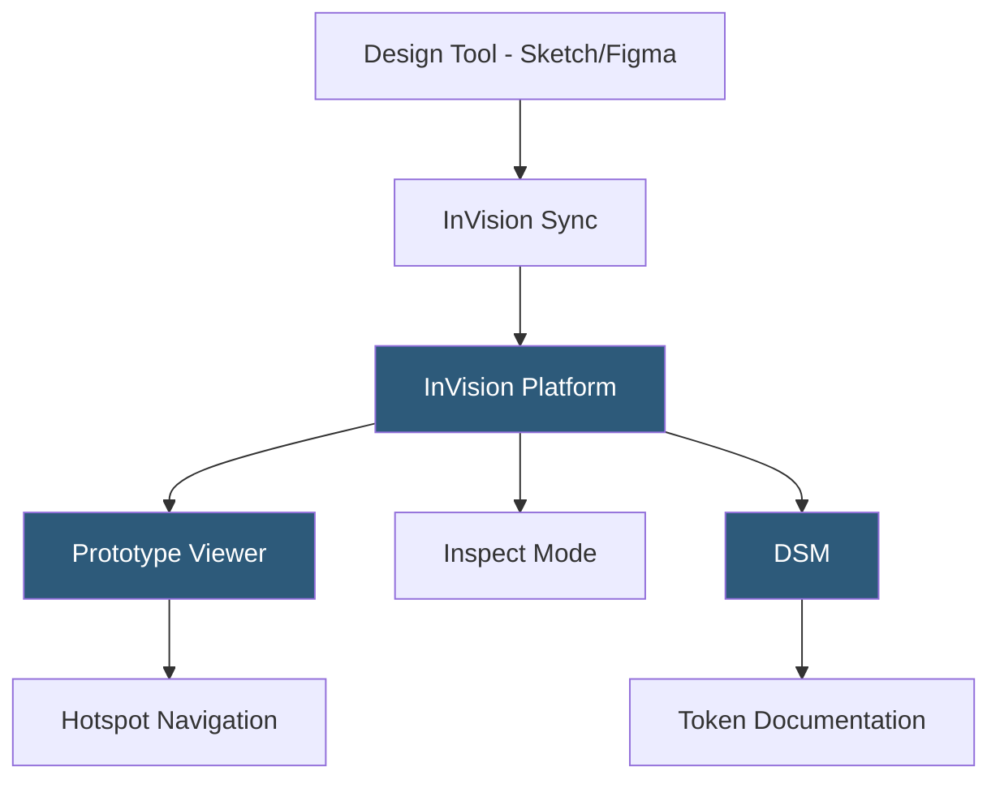

**Category:** UI/UX Design Platforms
**Difficulty:** Intermediate
**Reading time:** 5 min read

---

InVision is a design collaboration platform that pioneered the clickable prototype workflow for UI design teams. Originally a prototype-and-feedback tool for static design screens, InVision expanded into a full design platform with Freehand whiteboarding and the Design System Manager (DSM), before discontinuing its core products in 2024.

- **Prototypes** — InVision's original core feature: hotspot-linked screens creating clickable navigation flows from static images
- **Hotspots** — defined clickable areas on screen images triggering navigation to other screens
- **InVision Studio** — InVision's design tool (discontinued) competing with Sketch and Figma for native design creation
- **Inspect** — developer handoff view showing layer properties, measurements, and asset downloads from uploaded designs
- **InVision Freehand** — collaborative online whiteboard for team brainstorming and ideation
- **DSM (Design System Manager)** — InVision's design token and component documentation platform
- **Tour Points** — guided walkthroughs layered over prototype screens for stakeholder presentations

InVision's original workflow relied on sync integrations with Sketch (via the Craft plugin) or Figma to upload design screens to InVision's servers. On InVision, designers layered hotspots over uploaded screens—defining rectangular or custom-shape clickable zones that link to other screens with transition animations. The result was a shareable URL delivering a clickable prototype in the browser for client review and user testing.

The Inspect mode parsed uploaded screens (either design files or images) to extract pixel measurements between elements, approximate CSS values, and allow asset downloads. For Sketch syncs, InVision could extract more accurate layer data; for image uploads, inspection was less precise.

DSM (Design System Manager) was InVision's response to design system documentation needs. It allowed design teams to document components, usage guidelines, code snippets, and design tokens in an organized system. DSM integrated with Sketch Libraries to keep component documentation synchronized with source designs and generated shareable web documentation sites accessible to engineering teams.

InVision announced the shutdown of its core prototyping platform and DSM in late 2023, with services discontinued in 2024. Freehand was sold to Miro. The company's trajectory reflects the competitive shift toward all-in-one platforms like Figma that made standalone prototyping tools redundant.

- Legacy teams maintaining existing InVision prototype archives
- Historical context for design collaboration workflow evolution
- Understanding early design handoff methodologies before integrated platforms
- Teams migrating InVision DSM documentation to Figma or Zeroheight
- Design historians studying the evolution of design tooling ecosystems

| Advantage | Disadvantage |
|-----------|--------------|
| Pioneered the design review and prototype sharing workflow | Core platform discontinued in 2024 |
| DSM established design system documentation conventions | Requires separate design tool; not a standalone design application |
| Freehand provided strong whiteboarding for design teams | Fragmented toolset competed poorly against integrated Figma |
| Tour Points enabled guided walkthroughs for less-technical stakeholders | Hotspot-based prototyping less sophisticated than Smart Animate |

- [Figma Collaborative Design](figma-collaborative-design.md)
- [InVision Freehand Whiteboard](invision-freehand-whiteboard.md)
- [InVision DSM Design System](invision-dsm-design-system.md)

---
*Part of the [UI/UX Design Platforms](index.md) category · [Back to Master Index](../../index.md)*
