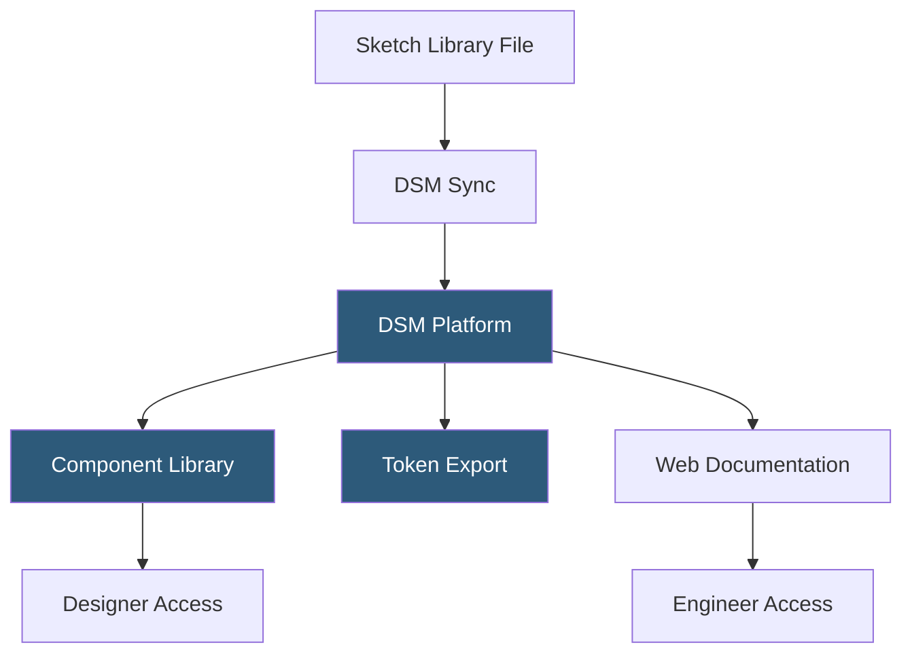

**Category:** UI/UX Design Platforms
**Difficulty:** Advanced
**Reading time:** 6 min read

---

InVision DSM (Design System Manager) was InVision's platform for building, documenting, and distributing design systems. It bridged Sketch Libraries with web-based component documentation, enabling design system teams to publish token values, component specifications, and usage guidelines accessible to both designers and engineers.

- **DSM Library** — the central repository of design system components, colors, typography, and icons managed in DSM
- **Sketch Integration** — DSM's sync with Sketch Libraries updating design system components bidirectionally
- **Design Tokens** — named values for colors, spacing, and typography exported from DSM to JSON for code integration
- **Component Documentation** — structured pages documenting component usage, variants, and do/don't guidelines
- **Code Snippets** — embedded code examples for React, Angular, iOS, and Android shown alongside component specs
- **Accessibility Notes** — compliance documentation fields for WCAG criteria attached to each component
- **DSM Embed** — embeddable DSM component documentation widget for insertion into team wikis and Confluence

DSM connected to Sketch via a browser extension that synced symbols from Sketch Libraries to the DSM platform. When a designer updated a component symbol in Sketch and pushed to DSM, the change propagated to the DSM web interface, updating the visual representation and any linked documentation. DSM could also push component updates back to Sketch libraries, enabling a bidirectional sync model where documentation and design files stayed in alignment.

Design tokens in DSM were defined as named value maps. Color tokens were organized hierarchically (brand colors, semantic colors, component-specific tokens), and DSM generated export files in JSON, XML, and Sass formats. These exports were consumed by engineering teams to populate CSS custom properties, iOS color assets, or Android resource files. The token hierarchy enforced naming conventions that mapped design decisions to code variables.

Component documentation pages in DSM used a structured template: a visual preview (pulled from the Sketch symbol), a description, usage guidelines, accessibility information, and code snippet blocks. Code snippets were manually maintained rather than auto-generated—engineers updated snippets when implementation changed. DSM Embed allowed embedding component documentation directly in Confluence or other team wikis as iframes, reducing context switching.

InVision shut down DSM along with its core platform in 2024. Teams using DSM were advised to migrate to alternatives including Supernova, Zeroheight, or Figma's built-in documentation capabilities. The void DSM left highlighted the need for dedicated design system documentation tools separate from design file management.

- Enterprise design teams building comprehensive component documentation portals
- Cross-functional design systems teams with separate design and engineering contributors
- Organizations requiring WCAG compliance documentation per component
- Teams integrating design tokens into CI/CD pipelines via JSON export
- Design system teams publishing a developer-facing documentation site

| Advantage | Disadvantage |
|-----------|--------------|
| Bidirectional Sketch sync kept documentation and design in alignment | Discontinued in 2024; no longer viable for new projects |
| Structured documentation template enforced design system completeness | Sketch-first architecture provided no Figma native integration |
| Token export pipeline connected design decisions to engineering implementation | Code snippets required manual maintenance creating staleness risk |
| DSM Embed reduced wiki context-switching for engineering teams | Dependency on InVision platform created single-vendor risk |

- [InVision Design Collaboration](invision-design-collaboration.md)
- [Figma Design Systems](figma-design-systems.md)
- [Sketch Libraries](sketch-libraries.md)

---
*Part of the [UI/UX Design Platforms](index.md) category · [Back to Master Index](../../index.md)*
