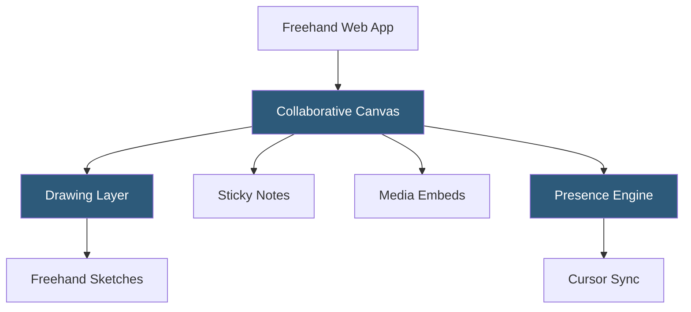

**Category:** UI/UX Design Platforms
**Difficulty:** Beginner
**Reading time:** 5 min read

---

InVision Freehand was an online collaborative whiteboard designed for design team brainstorming, design critiques, and workshop facilitation. Originally part of InVision's platform, Freehand was acquired by Miro in 2024 following InVision's shutdown, with its user base migrated to Miro's platform.

- **Infinite Canvas** — unbounded whiteboard surface for organizing content spatially without page constraints
- **Freehand Drawing** — pressure-sensitive stylus and mouse drawing for sketch-quality annotations
- **Sticky Notes** — color-coded idea capture cards for brainstorming and clustering activities
- **Image and Prototype Embeds** — embedding static images and InVision prototype links directly on the canvas
- **Cursor Presence** — real-time cursor tracking showing all active collaborators' positions and identity
- **Follow Mode** — attention-directing feature where facilitators guide all participants to focus on a canvas area
- **Presentation Mode** — focused linear presentation of canvas content for structured reviews

Freehand's collaborative canvas used WebSocket-based real-time sync similar to other collaborative tools. The canvas state was represented as a collection of objects—strokes, shapes, sticky notes, embeds—each with position, size, and content properties serialized as JSON. Operational transforms ensured concurrent edits by multiple users merged cleanly.

Freehand drawing used a pressure-sensitive stroke model. Mouse or stylus input was captured as a series of coordinate points with pressure values, smoothed using Bezier curve interpolation to produce natural-looking freehand lines. Strokes were stored as SVG path data, enabling crisp rendering at any zoom level without pixelation.

The InVision prototype embed was Freehand's distinguishing feature within the design workflow. Teams could embed live InVision prototype frames directly on the whiteboard canvas, enabling design critique sessions where the prototype was visible alongside annotations, feedback stickies, and comparison wireframes all in a single view.

Following Miro's acquisition of Freehand in 2024, existing Freehand boards were migrated to Miro's platform. Miro's technical infrastructure replaced Freehand's backend while preserving board content for continuity. The Freehand brand was subsequently retired.

- Design critique sessions with annotated prototype embeds and discussion threads
- Remote design sprint facilitation with distributed team ideation
- Product discovery workshops mapping user journeys on a shared canvas
- Team retrospectives with sticky note clustering and dot voting
- UX research affinity mapping after interview sessions

| Advantage | Disadvantage |
|-----------|--------------|
| Native InVision prototype embeds were uniquely useful in design review | Platform discontinued and migrated to Miro in 2024 |
| Freehand drawing quality was strong for annotation-heavy workflows | Less extensive template library than Miro or FigJam at peak |
| Follow Mode was effective for facilitated design review sessions | Platform uncertainty during InVision's wind-down period affected adoption |
| Integration with InVision DSM supported design system discussions | Now subsumed into Miro; not available as a standalone product |

- [InVision Design Collaboration](invision-design-collaboration.md)
- [Miro Collaborative Whiteboard](miro-collaborative-whiteboard.md)
- [FigJam Whiteboarding](figjam-whiteboarding.md)

---
*Part of the [UI/UX Design Platforms](index.md) category · [Back to Master Index](../../index.md)*
