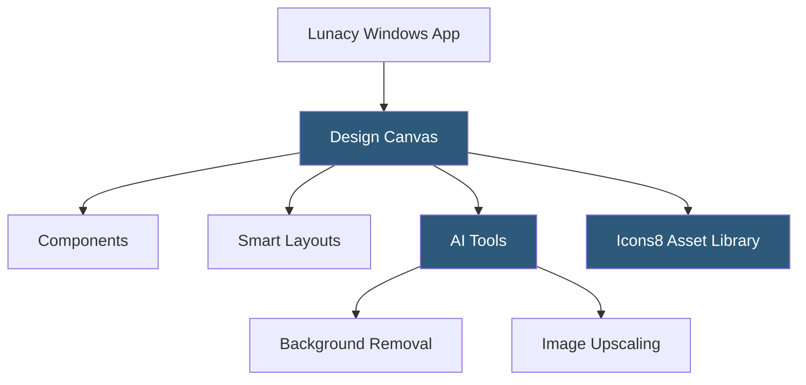

**Category:** UI/UX Design Platforms
**Difficulty:** Beginner
**Reading time:** 5 min read

---

Lunacy is a free, native Windows design application developed by Icons8 that natively opens Sketch files. It provides a design environment comparable to Sketch with built-in AI-powered tools, a built-in asset library of icons, illustrations, and photos, and both local and cloud collaboration capabilities—all at no cost.

- **Sketch File Compatibility** — Lunacy reads and writes `.sketch` files natively, enabling migration from Sketch workflows
- **Built-in Asset Library** — integrated access to Icons8's library of icons, illustrations, and stock photos without leaving the app
- **AI-Powered Tools** — background removal, image upscaling, avatar generation, and text generation using AI
- **Smart Layouts** — auto-resize containers similar to Figma's Auto Layout and Sketch's Smart Layout
- **Components** — reusable symbol-like elements with override capabilities for design system use
- **Cloud Documents** — Lunacy's cloud storage for file sync, sharing, and basic collaboration
- **Vector Tools** — comprehensive vector drawing tools including pen, boolean operations, and path editing

Lunacy is a C#/.NET native Windows application, giving it desktop-native performance for file rendering and manipulation. The application reads Sketch's binary file format (a macOS bundle internally containing JSON and images), enabling Windows designers to work with Sketch files without needing a Mac. Sketch compatibility covers layers, symbols, styles, and prototypes, though some advanced Sketch features may have partial support.

Smart Layouts in Lunacy configure containers to resize horizontally or vertically based on their content, matching Sketch's Smart Layout behavior. Components (Lunacy's term for symbols) support a full override system: instances can override text content, image fills, and nested component substitutions from a properties panel.

The integrated Icons8 library provides access to Icons8's 200,000+ icon set directly in Lunacy's assets panel. Free plan users access a subset; paid Icons8 subscriptions unlock all styles and formats. Illustrations and stock photos are similarly accessible through panel tabs. This eliminates the need for separate icon management tools or external asset download workflows.

AI tools are powered by Icons8's backend services. Background removal applies semantic segmentation to selected images, isolating subjects. The Image Upscaler uses super-resolution models to enlarge low-resolution images while maintaining quality. The Text Generator creates placeholder content for the selected language and content type. These features are accessible through right-click context menus on applicable elements.

- Windows-based design teams needing Sketch-file compatibility without Mac hardware
- Designers seeking a free Figma/Sketch alternative without subscription costs
- Teams with embedded Icons8 asset workflows wanting integrated asset access
- Individual designers on Windows exploring professional UI design capabilities
- Organizations with corporate Windows-only environments needing design tools

| Advantage | Disadvantage |
|-----------|--------------|
| Completely free for core functionality; no subscription required | Windows-only; no macOS, Linux, or browser version |
| Sketch file compatibility enables Windows-Mac team collaboration | Smaller community and plugin ecosystem compared to Figma or Sketch |
| Built-in Icons8 library reduces asset workflow friction | Cloud collaboration less mature than Figma's real-time multiplayer |
| AI background removal and upscaling built in without external tools | Advanced design system features less comprehensive than Figma |

- [Figma Collaborative Design](figma-collaborative-design.md)
- [Sketch Design Toolkit](sketch-design-toolkit.md)
- [Penpot Open-Source Design](penpot-open-source-design.md)

---
*Part of the [UI/UX Design Platforms](index.md) category · [Back to Master Index](../../index.md)*
