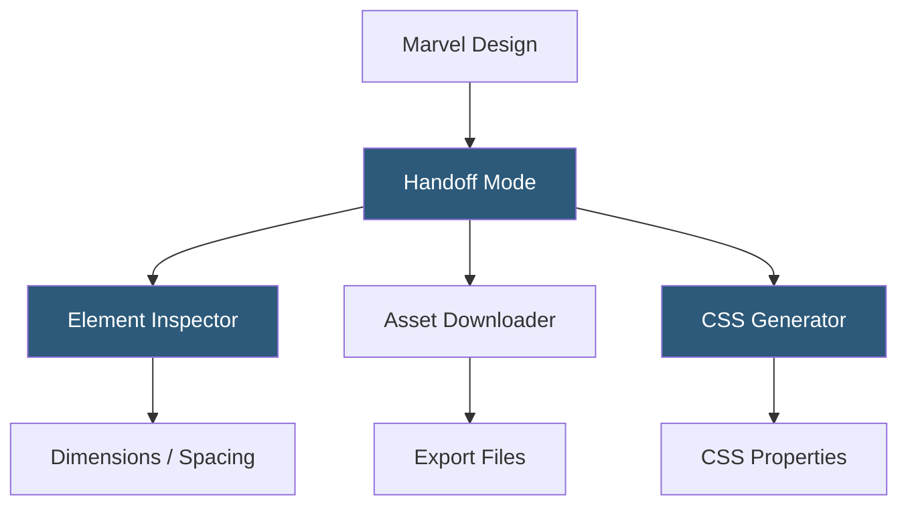

**Category:** UI/UX Design Platforms
**Difficulty:** Beginner
**Reading time:** 5 min read

---

Marvel's Design Handoff feature provides developers with a browser-based inspection interface for measuring element dimensions, extracting CSS values, and downloading assets from Marvel prototypes and design files. It enables design-to-development workflow without requiring developers to have Marvel design editor access.

- **Handoff View** — dedicated inspection mode exposing layer properties and measurements for developers
- **CSS Export** — automatically generated CSS property values from design element styles
- **Spacing and Dimension Inspection** — pixel measurements between elements and parent containers
- **Asset Export** — downloadable design assets (icons, images) in configurable file formats
- **Shared Handoff Links** — publicly accessible URLs giving developers view-only handoff access
- **Annotation Layer** — design notes and specifications attached to elements in the handoff view
- **Spec View** — per-screen property overview listing all colors and fonts used in a design

Marvel Handoff is activated by sharing a design project with Handoff permissions. Developers receive a link opening the project in a browser-based viewer with inspection capabilities. Clicking any element—regardless of whether it was created in Marvel's editor or uploaded as an image—opens an Inspector panel on the right side.

For designs created in Marvel's native design editor, the Inspector displays accurate properties: exact dimensions in pixels, hex color values for fills and borders, font-family and font-size for text layers, opacity levels, and shadow configurations. CSS values are generated from these properties using standard mapping rules—a rectangle with a border becomes a `border` CSS rule, opacity maps to `opacity`, and border-radius maps to `border-radius`.

For screens uploaded as images (PNG, JPEG) or imported from Sketch or Figma as flattened renders, inspection is limited to visual reference only—element properties cannot be extracted from raster images. This is Marvel's primary limitation compared to Figma Dev Mode or Zeplin, which parse vector source files for precise data.

Asset export works for elements explicitly marked as exportable in Marvel's design editor. Exportable elements appear as downloadable items in the Handoff view, with format options (PNG at 1x/2x/3x, SVG, PDF) configured in the design file. The Spec View provides a quick summary of all unique colors and typography styles used across a screen, serving as a design token audit without systematic token infrastructure.

- Developer inspection of Marvel-native designs for CSS property extraction
- Remote developer access to design specifications without Marvel designer accounts
- Asset download workflow for icon and illustration extraction
- Design annotation documentation for engineering handoff notes
- Spec auditing for identifying inconsistent colors and typography in designs

| Advantage | Disadvantage |
|-----------|--------------|
| No developer account required for handoff view access | Handoff accuracy limited for image-based imported designs |
| CSS generation reduces manual transcription errors | Less comprehensive than Figma Dev Mode or Zeplin for complex systems |
| Asset export directly from handoff reduces back-and-forth | No design token or variable system integration |
| Annotation notes bridge visual design to written specification | Limited to designs hosted on Marvel; no cross-tool support |

- [Marvel Prototyping Platform](marvel-prototyping-platform.md)
- [Figma Dev Mode](figma-dev-mode.md)
- [UXPin Design Platform](uxpin-design-platform.md)

---
*Part of the [UI/UX Design Platforms](index.md) category · [Back to Master Index](../../index.md)*
