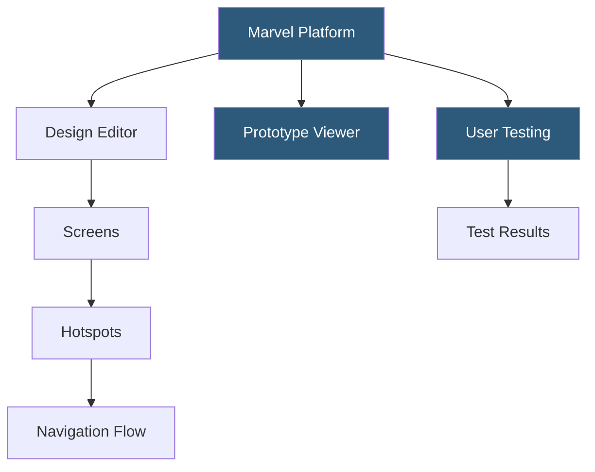

**Category:** UI/UX Design Platforms
**Difficulty:** Beginner
**Reading time:** 5 min read

---

Marvel is a browser-based design and prototyping platform enabling teams to create interactive prototypes, conduct user testing, and collect design feedback without requiring deep design tool expertise. It offers both design creation capabilities and prototype-from-import workflows for teams using Sketch or Figma.

- **Hotspot Links** — clickable zones on design screens triggering navigation to other screens with transition animations
- **Design Mode** — Marvel's built-in vector editor for creating designs directly within the platform
- **User Testing** — Marvel's built-in moderated and unmoderated user research feature for prototype testing
- **Handoff** — developer inspect mode showing CSS values, measurements, and asset downloads
- **Import from Sketch/Figma** — syncing design screens from external tools into Marvel prototypes
- **Prototype Templates** — starting templates for common app flows (onboarding, checkout, navigation)
- **Marvel API** — REST API enabling programmatic access to projects, prototypes, and testing results

Marvel's prototyping model follows the screen-hotspot-transition paradigm. Designers upload or create screens, then enter Prototype mode to draw hotspot areas over screen regions. Each hotspot is configured with a target screen and a transition type (slide, fade, pop, instant). The resulting prototype is playable in a browser or on device via Marvel's mobile apps.

The built-in Design editor uses a simplified vector toolset compared to Figma or Sketch—rectangles, ellipses, text, and image placement—suitable for basic wireframing or simple UI creation. For production-quality design work, most teams import screens from Sketch (using Marvel's Sketch plugin) or upload images directly.

User Testing integrates prototype sharing with a research collection layer. Teams create test tasks ("Find the checkout button and complete a purchase"), share the test link with participants, and Marvel records taps, misclicks, and navigation paths. Unmoderated tests capture this data automatically; moderated tests enable facilitator notes. Results are visualized as heatmaps and click paths in the research dashboard.

The Handoff feature (available on paid plans) renders uploaded designs as inspect views. Selecting any element shows positioning, font properties, colors, and spacing. Compared to Figma's Dev Mode or Zeplin, Marvel's inspect accuracy depends on design file quality—designs built in Marvel's editor are fully inspectable, while image uploads provide only visual reference without layer data.

- Small teams and startups validating UI concepts quickly without heavy tool investment
- Non-designers creating basic wireframe prototypes for user research
- Researchers conducting remote unmoderated user testing on design prototypes
- Product managers creating clickable user flow demonstrations for stakeholders
- Teams supplementing Figma workflows with built-in user testing capabilities

| Advantage | Disadvantage |
|-----------|--------------|
| Built-in user testing eliminates need for separate research tools | Less powerful prototyping than Figma or ProtoPie |
| Low learning curve accessible to non-design practitioners | Design editor is basic; not suitable for production design work |
| User testing heatmaps and paths provide immediate research insights | Inspect accuracy limited for image-based rather than vector-based screens |
| Affordable pricing for small team access | Smaller community and ecosystem than Figma |

- [Marvel Design Handoff](marvel-design-handoff.md)
- [Figma Prototyping](figma-prototyping.md)
- [UXPin Design Platform](uxpin-design-platform.md)

---
*Part of the [UI/UX Design Platforms](index.md) category · [Back to Master Index](../../index.md)*
