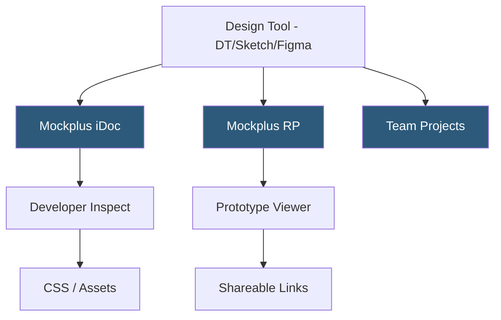

**Category:** UI/UX Design Platforms
**Difficulty:** Beginner
**Reading time:** 5 min read

---

Mockplus is a rapid prototyping and design collaboration platform offering three integrated products: Mockplus RP for interaction design, Mockplus DT for UI design (similar to Figma), and Mockplus iDoc for design handoff. It targets enterprise teams seeking an all-in-one design workflow platform with strong team collaboration and asset management features.

- **Mockplus RP** — rapid prototyping tool with component library and drag-and-drop interaction building
- **Mockplus DT** — UI design tool with auto-layout, components, and design system capabilities
- **Mockplus iDoc** — design handoff platform for developer specification inspection and asset export
- **Component Library** — built-in library of mobile and web UI components for rapid wireframing
- **Interaction Linking** — connection-based prototype navigation with transition animation options
- **Team Projects** — project-level organization with role-based access and asset sharing
- **Sketch/Figma Import** — iDoc support for importing design files from other tools for handoff

Mockplus's suite approach positions it as a full design workflow platform. Mockplus RP handles wireframing and interaction prototyping with a component drag-and-drop canvas. Interactions are defined through connection lines between screens with configurable transition types. The component library includes pre-built mobile (iOS, Android) and web UI elements reducing the time to create wireframe screens.

Mockplus DT functions as a Figma-alternative design tool with auto-layout, shared component libraries, and design system management. It is browser-based with desktop apps available, supporting real-time collaboration. Design systems defined in DT can be shared across team members as library files.

Mockplus iDoc is the design handoff layer. It accepts imports from Sketch, Figma, Adobe XD, and Mockplus DT. When a design is uploaded to iDoc, it renders an inspection view exposing layer dimensions, CSS values, font specifications, and color values. Asset export is available for any marked-exportable layer. Developers access iDoc through a web browser without needing the design tool.

The enterprise pricing model bundles all three products (RP, DT, iDoc) with team project management, asset library sharing, and audit logs. Mockplus's market positioning emphasizes competitive pricing compared to Figma's enterprise tier while providing comparable feature depth, targeting mid-market teams seeking integrated tooling without the Figma price premium.

- Enterprise teams wanting integrated prototyping and handoff in one subscription
- Organizations transitioning from multiple point tools to a unified design platform
- Teams requiring on-premise or private deployment options for data security
- Asian market companies (Mockplus is China-headquartered) with local support needs
- Small-to-medium teams wanting Figma-comparable features at lower cost

| Advantage | Disadvantage |
|-----------|--------------|
| All-in-one suite reduces multi-tool management overhead | Smaller community and plugin ecosystem than Figma |
| Competitive enterprise pricing versus Figma's organization tier | Less brand recognition may affect designer hiring and onboarding |
| Sketch/Figma import enables iDoc without full platform migration | DT feature parity with Figma's advanced features is still maturing |
| Strong Asian market support and localization | Fewer integrations with Western enterprise tools (Jira, Confluence) |

- [Figma Collaborative Design](figma-collaborative-design.md)
- [UXPin Design Platform](uxpin-design-platform.md)
- [Marvel Prototyping Platform](marvel-prototyping-platform.md)

---
*Part of the [UI/UX Design Platforms](index.md) category · [Back to Master Index](../../index.md)*
