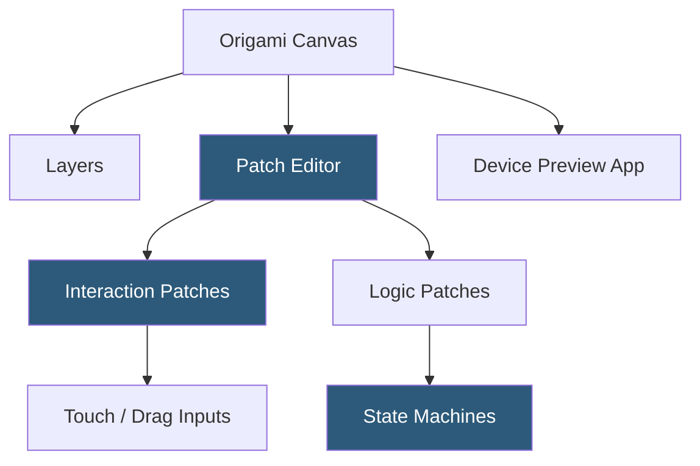

**Category:** UI/UX Design Platforms
**Difficulty:** Advanced
**Reading time:** 6 min read

---

Origami Studio is a free macOS prototyping tool developed by Meta (formerly Facebook) for designing advanced interactive prototypes using a node-based visual programming model. It was created internally at Facebook to prototype complex interactions for products like Messenger and Instagram, and later released publicly as a free tool.

- **Patch System** — Origami's node-based visual programming environment where logic components ("patches") are connected by wires
- **Layers** — design elements from Sketch or created within Origami displayed on the prototype canvas
- **Interactions** — patches responding to user gestures (touch, click, scroll, swipe) and producing behavioral outputs
- **Components** — reusable patch networks encapsulated into custom named components for complex prototype organization
- **State Machines** — Origami's built-in state machine patch for modeling complex multi-state transitions
- **Device Preview** — Origami Live iOS/Android app for testing prototypes on real devices over WiFi
- **JavaScript Patches** — custom JavaScript logic patches for computations beyond built-in patch capabilities

Origami uses a two-pane interface: the Layer panel showing the design hierarchy and the Patch editor below, where logic wires connect patches into behavioral networks. The fundamental flow is: input patches (Touch, Scroll Position, Keyboard) produce values that pass through logic patches (Switch, Delay, Pop Animation, Spring) to output patches that control layer properties (Position, Opacity, Scale).

A simple button press interaction: a Touch patch outputs `1` (down) and `0` (up) for tap events. This connects to a Toggle patch that alternates between `0` and `1` with each tap. The Toggle output connects to a Transition patch defining two position values (panel closed, panel open). The result drives a layer's Y position, creating a drawer that opens and closes on tap—all without writing code.

State Machines address complex conditional flows. Rather than nested conditionals, Origami's Option Switch and State Machine patches model finite state automata visually. A navigation component might have states (Home, Menu, Profile) with defined transition triggers. State machines prevent illegal transitions and ensure prototype behavior matches intended application logic.

Origami's patch system is visually similar to audio/visual programming environments like Max/MSP or Quartz Composer (which Origami was built on top of). This lineage means Origami is exceptionally powerful for continuous-value animations, physics simulations, and gesture-driven prototypes, but has a significant learning curve for designers unfamiliar with dataflow programming.

- High-fidelity mobile app interaction prototyping for Facebook/Meta-scale products
- Physics-based gesture interaction design (springy scroll, momentum flicks)
- Complex navigation pattern prototyping with state machine precision
- Research validation of interaction patterns before engineering investment
- Animation timing and feel experiments requiring precise spring parameter tuning

| Advantage | Disadvantage |
|-----------|--------------|
| Node-based logic enables interactions ProtoPie and Figma cannot replicate | Steep learning curve; patch-based programming is unfamiliar to most designers |
| Free and well-maintained by Meta's design infrastructure team | macOS only with no browser or Windows support |
| Origami Live enables real device testing with actual hardware performance | No built-in design tools; requires importing from Sketch |
| State machines handle complex multi-state interactions precisely | Not suitable for quick wireframing or low-fidelity design work |

- [ProtoPie Interaction Design](protopie-interaction-design.md)
- [Principle Animation Tool](principle-animation-tool.md)
- [Figma Prototyping](figma-prototyping.md)

---
*Part of the [UI/UX Design Platforms](index.md) category · [Back to Master Index](../../index.md)*
