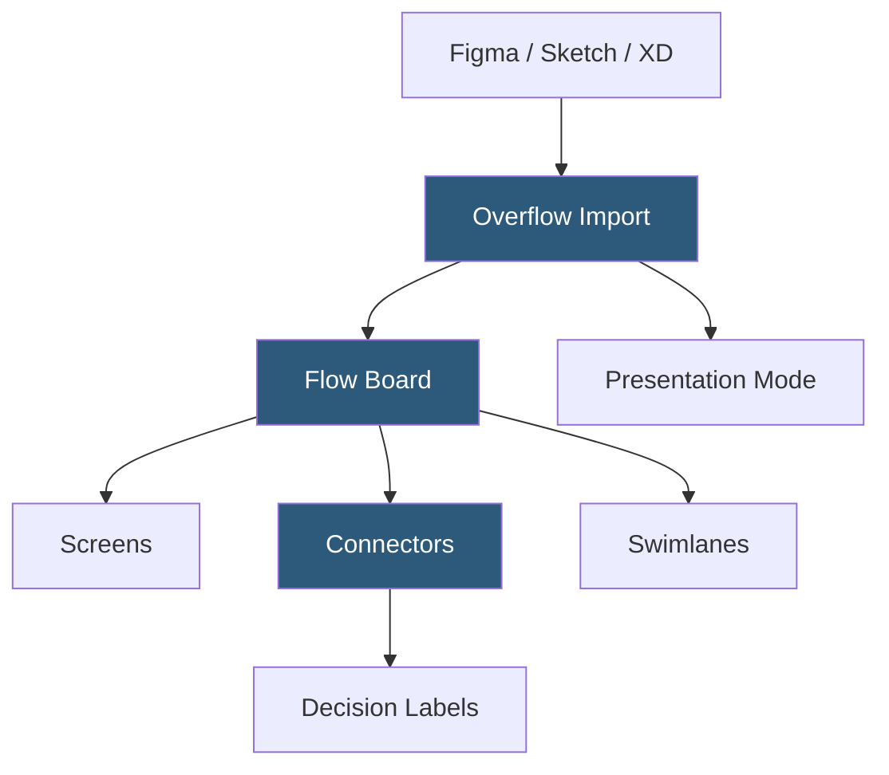

**Category:** UI/UX Design Platforms
**Difficulty:** Beginner
**Reading time:** 5 min read

---

Overflow is a specialized tool for creating user flow diagrams that connect design screens into visual flowcharts, enabling designers to communicate application architecture, decision trees, and navigation paths to stakeholders, developers, and clients. It imports screens from Figma, Sketch, and Adobe XD and adds flow connectors without modifying source designs.

- **Flow Boards** — Overflow's canvas where screens are arranged and connected with arrows to form user flow diagrams
- **Screen Import** — importing artboards/frames from Figma, Sketch, or XD as visual screens on the board
- **Connectors** — directional arrows with labels representing navigation paths and decision branches
- **Swimlanes** — horizontal or vertical bands organizing flows by user role, device, or journey phase
- **Presentation Mode** — full-screen walkthrough of the flow diagram for client and stakeholder meetings
- **Interactive Prototype** — optional mode making screen images clickable for basic navigation preview
- **Team Sharing** — cloud-based flow sharing for collaborative review and commenting

Overflow connects to design tools through plugins (Figma plugin, Sketch plugin) that sync artboards or frames to an Overflow project. The sync captures screen images—not editable vector data—and places them as visual objects on the Overflow canvas. When source designs update in Figma or Sketch, running the sync again refreshes screen images while preserving connector layout.

The flow board is an infinite canvas where screens are arranged spatially to represent information architecture. Connectors are drawn by clicking and dragging between screens, with directional arrows and optional text labels indicating the condition or action triggering navigation (e.g., "On submit", "Error state", "Registered user"). Connectors can branch, loop back, and connect to external nodes representing out-of-scope flows or off-screen interactions.

Swimlanes divide the canvas into labeled zones, commonly used for actor-based flows (User, System, Backend), device-type flows (Mobile, Desktop), or journey phase flows (Awareness, Consideration, Purchase). Screens dropped into a swimlane are visually associated with that category, making cross-role or cross-device flows easy to interpret.

Presentation Mode steps through connected screens in a defined order, with click-to-advance navigation for meeting walkthroughs. The presenter controls the pace while stakeholders follow the visual flow narrative. This mode is particularly effective for UX reviews where explaining the "why" of each navigation decision is as important as showing the screens themselves.

- Presenting complete application user flows in client onboarding and design reviews
- Developer handoff documentation showing all screens and their connections
- UX research documentation showing observed user paths through an existing product
- Information architecture planning before detailed screen design begins
- Multi-role journey mapping showing parallel user and system flows

| Advantage | Disadvantage |
|-----------|--------------|
| Dedicated flow tool produces cleaner diagrams than ad-hoc design canvas use | Single-purpose tool adding licensing cost alongside design tools |
| Sync with Figma/Sketch keeps screens current without re-import effort | Screen images become stale between manual syncs |
| Swimlanes enable multi-actor and multi-device flow organization | No design capability; purely for arranging and connecting existing screens |
| Presentation Mode provides a purpose-built meeting experience | Limited interaction annotation beyond connector labels |

- [Whimsical Wireframes and Diagrams](whimsical-wireframes-diagrams.md)
- [Figma Collaborative Design](figma-collaborative-design.md)
- [Miro Collaborative Whiteboard](miro-collaborative-whiteboard.md)

---
*Part of the [UI/UX Design Platforms](index.md) category · [Back to Master Index](../../index.md)*
