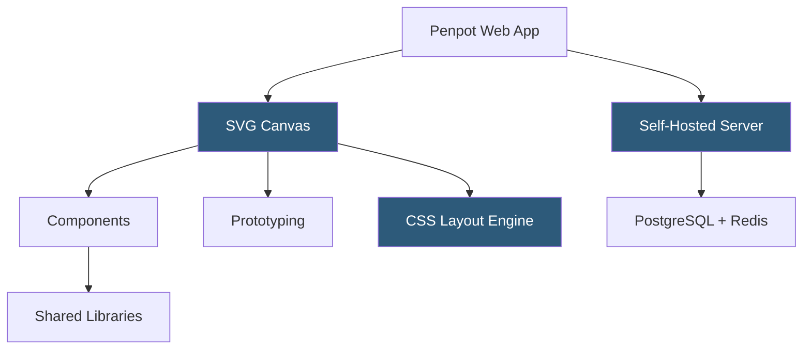

**Category:** UI/UX Design Platforms
**Difficulty:** Intermediate
**Reading time:** 6 min read

---

Penpot is the first open-source design and prototyping platform, providing a Figma-like design environment that teams can self-host on their own infrastructure. Built on web standards (SVG and CSS), it aims to give designers and developers a shared language for design specifications, with all design values corresponding directly to CSS properties.

- **Open-Source License** — Penpot is released under MPL 2.0, enabling self-hosting, modification, and community contributions
- **SVG-Based Rendering** — designs are stored and rendered as SVG, ensuring portability and standards compliance
- **CSS Grid and Flexbox Layout** — Penpot's layout system maps directly to CSS Grid and Flexbox specifications
- **Design Tokens** — first-class support for design tokens within Penpot's shared libraries
- **Self-Hosting** — Docker and Kubernetes deployment options for on-premise or private cloud installations
- **Penpot Cloud** — Penpot's managed SaaS offering for teams preferring hosted access
- **Components and Libraries** — shared component libraries with master component synchronization

Penpot's architecture is a ClojureScript single-page application communicating with a Clojure/JVM backend via WebSockets. The backend stores designs in a PostgreSQL database with event sourcing for real-time collaboration, and uses Redis for pub/sub messaging between server instances in clustered deployments.

The canvas renders designs as SVG elements. Every frame, shape, and component is an SVG node with CSS styling. This means Penpot's exported designs are standards-compliant SVG that opens in browsers, Inkscape, Affinity Designer, and other SVG-capable tools. The design-to-code value proposition is strong: because Penpot uses CSS Flexbox and Grid as its layout primitives, the layout names and values in the Penpot inspector directly correspond to the CSS properties an engineer writes.

Self-hosting uses Docker Compose for development and smaller deployments, with a Helm chart for Kubernetes production deployments. The architecture consists of front-end (nginx), app server, backend, and worker services plus PostgreSQL, Redis, and an optional S3-compatible object store for assets. SMTP configuration handles email notifications. The installation typically takes 20–30 minutes following the official guide.

Real-time collaboration uses the same WebSocket infrastructure as Figma conceptually—operational transforms broadcast to all connected clients for a shared document. Penpot's open infrastructure means organizations can inspect, audit, and modify the collaboration system, which is a significant advantage for security-conscious enterprises.

- Organizations with data residency requirements needing on-premise design tooling
- Open-source projects wanting design collaboration without SaaS vendor dependency
- Privacy-focused teams requiring self-hosted infrastructure for design assets
- Enterprises wanting Figma-like capabilities with full infrastructure ownership
- Educational institutions needing self-hosted tools for student design curricula

| Advantage | Disadvantage |
|-----------|--------------|
| Full data sovereignty through self-hosting | Self-hosting requires infrastructure maintenance and operational overhead |
| Open-source transparency; no black-box SaaS dependency | Feature parity with Figma still maturing in some advanced areas |
| CSS/SVG-native design values reduce handoff translation | Smaller plugin ecosystem than Figma's community marketplace |
| Free for self-hosted use at any scale | On-premise updates require manual deployment pipeline management |

- [Figma Collaborative Design](figma-collaborative-design.md)
- [Lunacy Windows Design Tool](lunacy-windows-design-tool.md)
- [Figma Design Systems](figma-design-systems.md)

---
*Part of the [UI/UX Design Platforms](index.md) category · [Back to Master Index](../../index.md)*
