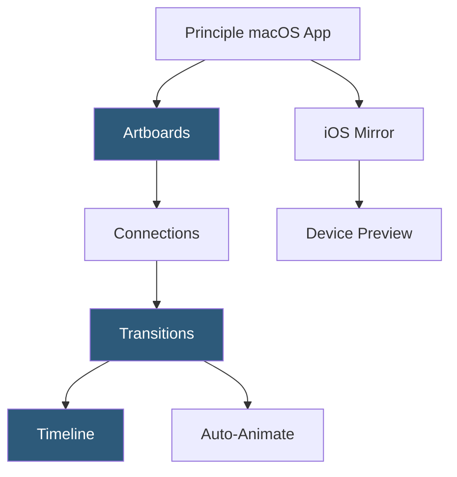

**Category:** UI/UX Design Platforms
**Difficulty:** Intermediate
**Reading time:** 5 min read

---

Principle is a macOS prototyping tool specialized for creating animated and interactive UI prototypes with a timeline-driven animation model. It is particularly popular for designing complex micro-interactions, animated transitions between screens, and multi-state UI components with high visual fidelity.

- **Drivers** — Principle's core animation model: scrolling, dragging, rotating, or pressing drives animation timelines
- **Components** — reusable interactive elements with their own state and animations, similar to Symbols
- **Artboards** — screen containers; animations are defined between artboard states
- **Auto connections** — automatic transition generation when layers have the same name across artboards
- **Timeline** — keyframe animation editor for defining per-property animation timing and easing
- **Record Mode** — real-time interaction recording for creating animations by performing them on screen
- **iOS Mirror App** — Principle's companion iPhone app for previewing prototypes on real devices

Principle's animation model centers on Drivers—the input that controls animation state. When a user connects two artboards with a Scroll driver, scrolling the first artboard drives animation progress: elements can fade, scale, translate, or change color as a direct function of scroll position. This driver model differs from trigger-then-play animations in Figma—in Principle, the animation is continuously responsive to input position, enabling physics-correct parallax and scroll-driven UI effects.

Auto connections recognize layers with matching names across artboards and animate their property differences automatically when transitioning. A button that changes size, color, and position between two artboards will animate all those changes simultaneously when Principle detects the connected artboards with same-named layers. This is similar to Figma's Smart Animate but Principle's timeline provides more granular control.

The Timeline panel provides keyframe-based control over every animated property. Setting a layer's `opacity` from 0 to 1 between 0ms and 300ms with ease-out easing, then adding a `scale` from 0.8 to 1 over the same range, creates a combined fade-and-scale entrance. Multiple layers can have independent timeline tracks with different durations and delays, enabling complex staggered animation choreography.

The iOS Mirror app connects to Principle over Wi-Fi and streams the prototype to the device, enabling testing with real touch gestures, device motion, and screen dimensions. This is critical for validating swipe thresholds, scroll physics, and touch target sizes that don't translate accurately from desktop mouse interactions.

- Micro-interaction design for mobile app components
- Scroll-driven parallax effects and animation testing
- High-fidelity animated transitions for developer reference videos
- Gesture interaction prototyping with real device testing via Mirror
- Animation direction documentation for engineering handoff

| Advantage | Disadvantage |
|-----------|--------------|
| Driver model enables continuously responsive input-driven animations | macOS only; not available on Windows or in browsers |
| Timeline provides precise frame-level animation control | No real-time collaboration; single-user desktop tool |
| iOS Mirror enables authentic device gesture testing | Sketch/Figma import is visual only; no component intelligence |
| Record mode allows animation capture by demonstration | Less suitable for complete app flow prototyping beyond animation focus |

- [ProtoPie Interaction Design](protopie-interaction-design.md)
- [Framer Motion Animations](framer-motion-animations.md)
- [Figma Prototyping](figma-prototyping.md)

---
*Part of the [UI/UX Design Platforms](index.md) category · [Back to Master Index](../../index.md)*
