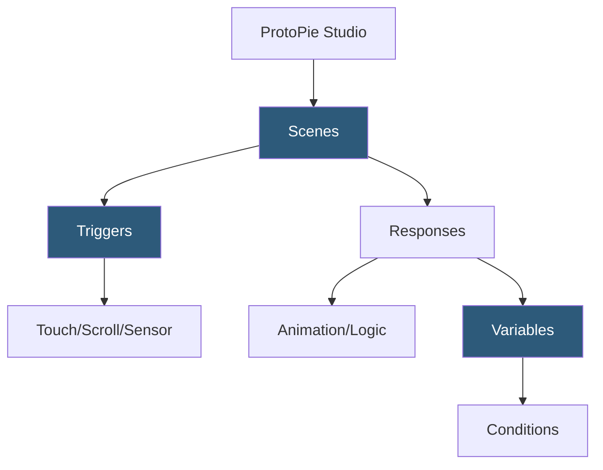

**Category:** UI/UX Design Platforms
**Difficulty:** Advanced
**Reading time:** 6 min read

---

ProtoPie is an advanced interaction design tool enabling highly realistic prototype creation using a trigger-response model without requiring code. It supports complex conditional logic, sensor inputs (gyroscope, camera), multi-finger gestures, and cross-prototype communication for sophisticated interaction pattern design.

- **Triggers** — events that start interactions: Touch, Scroll, Drag, Keyboard, Mouse, Time, Sound, Sensor
- **Responses** — actions triggered by events: Move, Scale, Rotate, Fade, Color Change, Sound Play, Formula evaluation
- **Conditions** — if/else logic branching interactions based on variable values or object states
- **Variables** — named values storing state across the prototype session for conditional interaction control
- **Formula** — expression language for calculated values: math operations, string manipulation, conditional expressions
- **ProtoPie Connect** — local relay protocol enabling two-prototype communication and external device integration
- **ProtoPie Cloud** — hosted prototype sharing and feedback collection platform

ProtoPie uses a Trigger-Response-Condition architecture. Each interaction is defined as: when this Trigger fires, and if this Condition is true, execute these Responses. This structure enables highly specific behavioral logic without a general programming language. A form validation interaction might say: when the Submit button is tapped, if the `email` variable matches an email regex, navigate to the success scene; else animate the email field red and show an error label.

Variables are the backbone of stateful prototyping. Numeric, string, and boolean variables can be set, incremented, decremented, and toggled through Response actions. A counter variable incremented by a button tap and read by a text label creates a real counter interaction. Variables persist across scenes, enabling shopping cart simulations, multi-step form progressions, and authentication flows.

ProtoPie's formula system allows reactive computed values. Setting a progress bar width using the formula `(currentStep / totalSteps) * 100` creates a progress bar that automatically reflects variable changes. Formulas support standard math operators, conditional ternary expressions (`condition ? trueValue : falseValue`), and string functions.

ProtoPie Connect enables cross-device and cross-prototype communication. A mobile prototype can send messages to a desktop prototype, enabling realistic connected device scenarios—a smartwatch prototype controlling a phone interface prototype, or a kiosk prototype interacting with a companion app prototype. Connect also interfaces with Arduino sensors and custom hardware, enabling physical-digital interaction prototypes for IoT UX research.

- Complex multi-state UI with conditional logic beyond Figma's capabilities
- Gesture-heavy mobile interfaces requiring gyroscope and touch input
- Connected device UX prototyping with cross-device communication
- Form validation and interactive input field prototyping
- Automotive and IoT interaction design requiring sensor input simulation

| Advantage | Disadvantage |
|-----------|--------------|
| Conditional logic enables realistic state-dependent interactions | Significant learning curve compared to simpler prototyping tools |
| Sensor and device input creates high-fidelity mobile testing | Not a design tool; requires importing from Sketch or Figma |
| ProtoPie Connect enables multi-device and hardware integration | More complex to maintain than simple hotspot prototypes |
| No-code formula system enables calculated interactions | Standalone tool adding cost alongside primary design tools |

- [Principle Animation Tool](principle-animation-tool.md)
- [Figma Prototyping](figma-prototyping.md)
- [Origami Studio by Facebook](origami-studio-by-facebook.md)

---
*Part of the [UI/UX Design Platforms](index.md) category · [Back to Master Index](../../index.md)*
