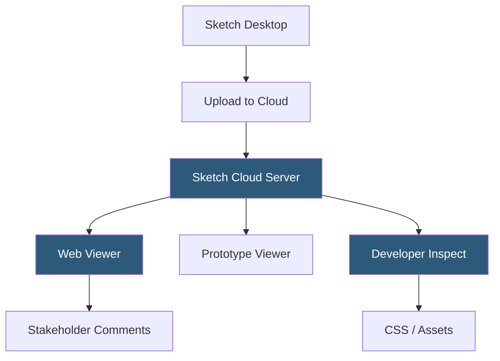

**Category:** UI/UX Design Platforms
**Difficulty:** Intermediate
**Reading time:** 5 min read

---

Sketch Cloud is Sketch's web-based platform for file hosting, prototype sharing, developer handoff, and team collaboration. It enables stakeholders to view and comment on designs in a browser without installing Sketch, and provides developers with inspection tools for extracting specifications and downloading assets.

- **Sketch Cloud Upload** — publishing Sketch documents to Sketch's cloud servers for browser-accessible sharing
- **Prototype Sharing** — interactive prototype links generated from Sketch's built-in prototyping for browser preview
- **Developer Handoff** — web inspect interface exposing layer measurements, CSS values, and asset exports
- **Commenting** — contextual comments placed on specific artboards or elements for design review
- **Version History** — cloud-stored document versions enabling comparison and rollback
- **Sketch for Teams** — subscription plan enabling organization-managed workspaces with role-based access
- **Web Viewer** — browser interface for non-Sketch users to navigate artboards and inspect element properties

Uploading to Sketch Cloud can be done via the Sketch application (Document > Publish to Sketch Cloud) or through the Sketch Mac app's automatic sync when using a Sketch for Teams workspace. The upload process packages the Sketch document and transmits it to Sketch's servers, where it is rendered into a web-accessible format. The web viewer uses SVG rendering of the artboards for display in the browser.

The Developer Inspect view parses the uploaded Sketch document to extract layer properties and presents them in a panel alongside the artboard view. Clicking any element shows dimensions, font properties, color values (as hex/RGB/HSL), and shadow/border specifications. CSS property values are auto-generated based on Sketch's layer properties—border-radius, font-family, line-height, etc. Asset export links allow downloading configured exportable layers directly from the browser.

Version history stores document snapshots each time a file is uploaded. Team members can compare artboards between versions to see what changed between design iterations. Version diff display shows artboards side-by-side with change highlights. Rollback creates a copy of the historical version as a new document in the workspace, preserving forward history.

Comments are anchored to specific artboard coordinates. Commenters (including non-Sketch users with Cloud view access) click an artboard to place a comment pin, which is then visible to all collaborators. Comment threads support replies and resolution marking. Comment notifications are sent via email or Slack integration for team awareness.

- Developer handoff for teams where engineers don't have Sketch licenses
- Stakeholder review rounds with contextual comment collection
- Client approval workflows presenting interactive prototypes for sign-off
- Design version control and archival for audit trails on approved designs
- Remote team collaboration supplementing the local Sketch application

| Advantage | Disadvantage |
|-----------|--------------|
| Stakeholders review designs without installing Sketch | Cloud does not support real-time co-editing like Figma |
| Developer Inspect provides accurate CSS extraction | Version history upload is manual; no continuous sync |
| Prototype sharing works in any browser without plugins | Web viewer is SVG-rendered; complex designs may not match pixel-perfectly |
| Commenting at artboard coordinate level is precise | Full team features require Sketch for Teams subscription |

- [Sketch Design Toolkit](sketch-design-toolkit.md)
- [Sketch Libraries](sketch-libraries.md)
- [Figma Collaborative Design](figma-collaborative-design.md)

---
*Part of the [UI/UX Design Platforms](index.md) category · [Back to Master Index](../../index.md)*
