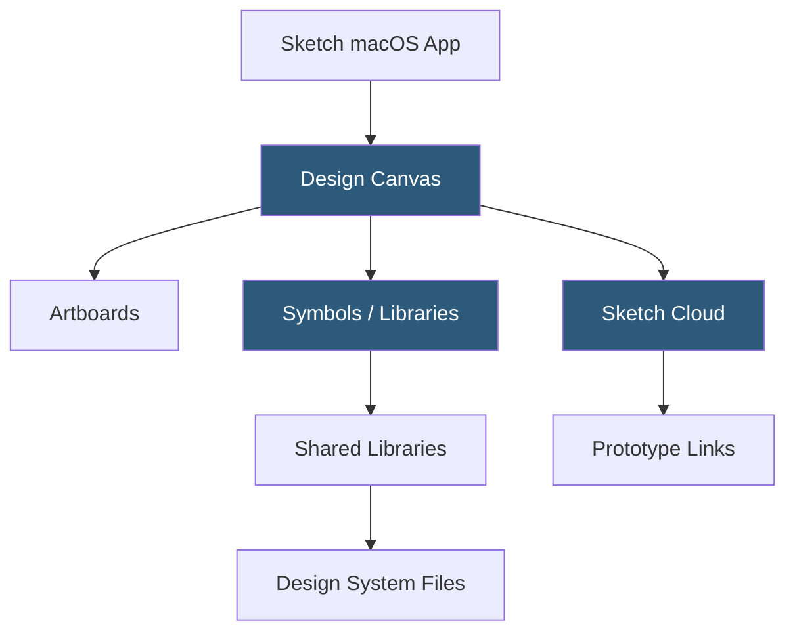

**Category:** UI/UX Design Platforms
**Difficulty:** Intermediate
**Reading time:** 6 min read

---

Sketch is a macOS-native vector design application that pioneered modern UI/UX design workflows with its Artboard-and-Symbol system. While Figma has displaced it as the industry default, Sketch remains highly capable for Mac-centric teams, offering a desktop-native performance advantage and a mature plugin ecosystem.

- **Artboards** — fixed canvas areas representing UI screens, responsive to preset device dimensions
- **Symbols** — Sketch's reusable components with override controls for text, image, and nested symbol substitution
- **Libraries** — shared Sketch files that publish Symbols and Styles to other documents for design system distribution
- **Smart Layout** — Sketch's auto-resizing system for Symbols that adjusts symbol dimensions based on content changes
- **Prototyping** — built-in click-through prototype creation with hotspot links and transition animations
- **Inspector Panel** — right-side panel displaying and editing all properties of selected layers
- **Sketch Cloud** — Sketch's web-based platform for file hosting, prototyping, and developer handoff

Sketch runs as a native macOS application built on AppKit and Core Graphics, giving it a distinct performance advantage for large files compared to browser-based tools. Files are stored as `.sketch` bundles—macOS packages containing JSON files and binary image assets, allowing version control via Git with readable JSON diffs.

Symbols are Sketch's component system. A Symbol is created from any layer group and registered in the Symbols page. Instances of a Symbol appear throughout the document. Symbol overrides allow instance-level customization: different text strings, image replacements, or nested symbol swaps. Smart Layout (Sketch's equivalent of Figma's Auto Layout) makes Symbols resize intelligently—a button Symbol with Smart Layout set to horizontal will grow or shrink based on its text content length.

Libraries connect design system files to product design files. When a Symbol or style is updated in a Library file, subscribed documents show a notification prompting users to update to the latest version. This pull-based update model differs from Figma's automatic propagation. Sketch Cloud hosts files accessible via browser for sharing prototypes and inspecting designs. Developers view specs, measure elements, and download assets through the Cloud's web interface without installing Sketch.

- macOS-centric design teams preferring a native application experience
- Teams with large design system libraries valuing Library Symbol workflows
- Developers on Mac teams inspecting designs through Sketch Cloud
- Organizations maintaining long-running projects on Sketch before migration
- Plugin developers building macOS-native Sketch extensions

| Advantage | Disadvantage |
|-----------|--------------|
| macOS native performance handles large files efficiently | macOS only; Windows and Linux teams cannot use Sketch |
| Git-friendly JSON file format enables version control | No real-time multiplayer collaboration like Figma |
| Mature Library system for design system distribution | Figma migration has reduced community investment in Sketch |
| Extensive plugin ecosystem with long development history | Requires Sketch license for file editing; view-only via Cloud |

- [Figma Collaborative Design](figma-collaborative-design.md)
- [Sketch Libraries](sketch-libraries.md)
- [Sketch Cloud Collaboration](sketch-cloud-collaboration.md)

---
*Part of the [UI/UX Design Platforms](index.md) category · [Back to Master Index](../../index.md)*
