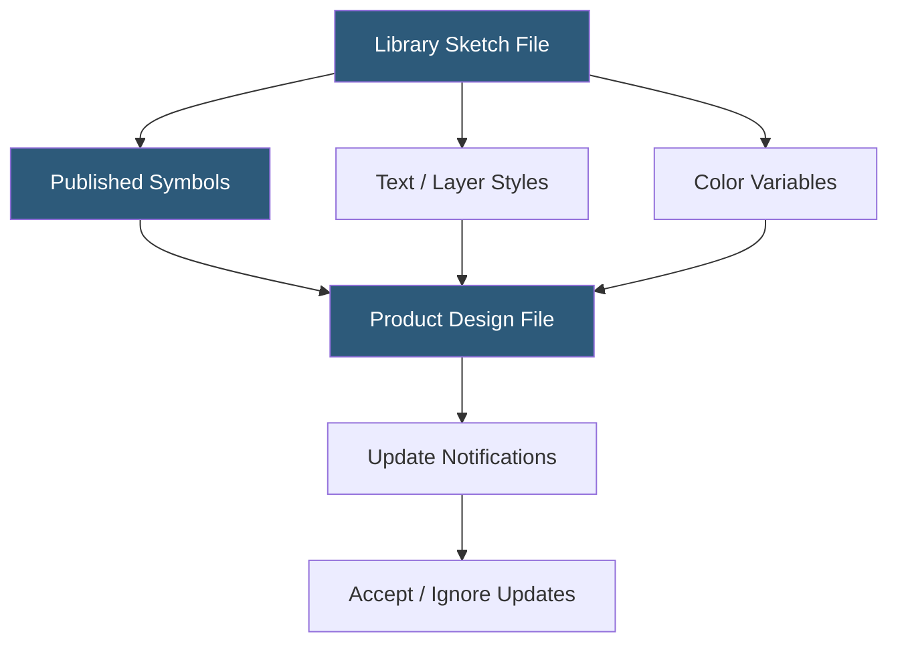

**Category:** UI/UX Design Platforms
**Difficulty:** Intermediate
**Reading time:** 5 min read

---

Sketch Libraries are shared Sketch files whose Symbols, Text Styles, Layer Styles, and Color Variables are made available to other Sketch documents. They form the foundation of design systems in Sketch-based workflows, enabling centralized component management with pull-based update propagation across teams.

- **Local Libraries** — library files stored on a user's Mac and available only to that machine
- **Cloud Libraries** — Sketch Cloud-hosted library files accessible to all team members with document access
- **Team Libraries** — shared libraries managed through Sketch for Teams subscriptions for organization-wide distribution
- **Library Updates** — notification-based system prompting designers to accept Symbol and Style updates from library sources
- **Linked Symbols** — symbols in product documents that reference the source symbol in the library file
- **Color Variables** — named color swatches in libraries that propagate to subscribed documents
- **Library Overrides** — ability to swap which library a Symbol instance uses without changing its override values

A Sketch Library is any Sketch file added to Sketch's Libraries preferences. Once added, all Symbols, Text Styles, Layer Styles, and Color Variables from that file appear in the Assets panel of any other open document. Designers insert library Symbols as instances, which maintain a link to the source symbol in the library file.

The update workflow is pull-based: when a library file is modified and saved (or re-uploaded for Cloud libraries), Sketch detects the change and shows a yellow notification badge in subscribed documents. Designers click "Updates Available" to review a diff of changed symbols and choose to accept or ignore each update. Accepted updates apply the library changes to all instances in the document. This explicit opt-in model prevents unexpected design changes from propagating automatically.

Library Overrides allow design system migrations. If a team moves from Library A to Library B, designers can batch-swap Symbol instances from one library to another through the Library Swap panel—instances update to the corresponding symbol from the new library while preserving their override values (text, images). This enables library vendor migrations or design system consolidations.

Cloud Libraries hosted on Sketch Cloud (Sketch for Teams subscription) are stored as Sketch documents on Sketch's servers. Team members subscribe by opening the library document and clicking "Use as Library." Sketch periodically checks for updates to subscribed Cloud Libraries and queues notifications. This differs from local libraries, which are polled based on file modification time on the local filesystem.

- Design systems teams distributing components to multiple product teams
- Agencies managing brand component libraries shared across client projects
- Multi-platform design where iOS and Android component libraries are separate
- Organizations migrating between library versions in a controlled update sequence
- Teams using Storybook-linked design tokens synced from library color variables

| Advantage | Disadvantage |
|-----------|--------------|
| Pull-based updates prevent unwanted propagation of breaking changes | Manual update acceptance creates delay between system update and design file use |
| Library Swap enables controlled library migrations | Real-time push propagation (as in Figma) requires separate design sync plugins |
| Cloud Libraries enable team-wide access without shared drives | Cloud Libraries require Sketch for Teams subscription |
| Color Variables and Styles propagate design system foundations efficiently | No built-in diff visualization for complex symbol structure changes |

- [Sketch Design Toolkit](sketch-design-toolkit.md)
- [Sketch Cloud Collaboration](sketch-cloud-collaboration.md)
- [Figma Design Systems](figma-design-systems.md)

---
*Part of the [UI/UX Design Platforms](index.md) category · [Back to Master Index](../../index.md)*
