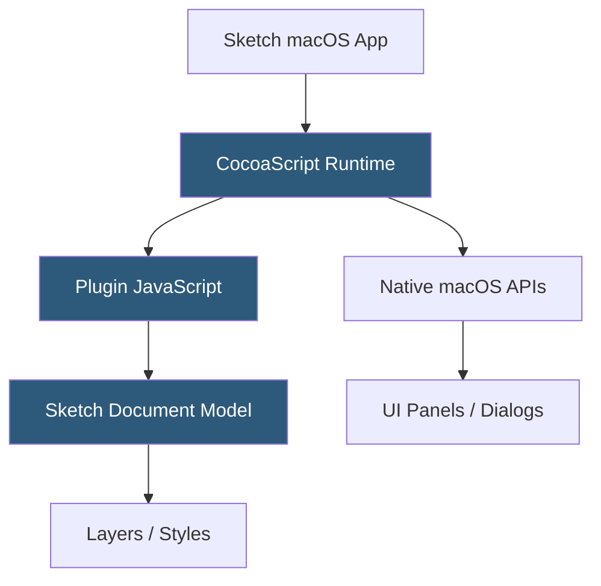

**Category:** UI/UX Design Platforms
**Difficulty:** Intermediate
**Reading time:** 5 min read

---

The Sketch Plugins Marketplace is the community ecosystem of third-party extensions for Sketch, distributed through Sketch's built-in Plugin Manager and the community-maintained sketchpacks.com directory. Plugins are built with JavaScript and access Sketch's CocoaScript bridge to automate tasks, integrate services, and extend the application's capabilities.

- **CocoaScript Bridge** — Sketch's plugin runtime that enables JavaScript code to call native macOS Objective-C/Swift APIs
- **Plugin Manager** — Sketch's built-in interface for discovering and installing plugins from registered sources
- **Sketch Plugin API** — JavaScript API exposing Sketch's document model, selection, and UI for programmatic access
- **Plugin Bundle** — folder structure (`.sketchplugin`) containing JavaScript files, manifest, and resources
- **MSLayer / MSArtboardGroup** — macOS native Sketch model classes accessible through CocoaScript from plugins
- **Sketchpacks** — community-maintained plugin registry at sketchpacks.com indexing open-source Sketch plugins
- **Runner Plugin** — popular third-party plugin providing a command palette for accessing all Sketch commands and plugins

Sketch plugins run inside CocoaScript—a JavaScript runtime with a bridge to Objective-C/Swift native APIs. This architecture means plugin code is JavaScript that can call native macOS framework classes directly. A plugin can instantiate an `NSAlert` for a dialog, call Sketch's internal `MSDocument` class to access the design document, or use `NSURLSession` for network requests—all from JavaScript.

The Sketch Plugin API provides JavaScript wrappers around the core Sketch model classes. Plugins interact with artboards, layers, symbols, text, and styles through these wrapper objects. The typical plugin pattern is: get the current selection (`context.selection`), iterate over selected items, apply transformations using layer API methods, and optionally refresh the document view.

Unlike Figma's sandboxed plugin environment, Sketch plugins have broad macOS system access (filesystem, network, native UI). This power comes with a security tradeoff: plugins are not sandboxed and run with full macOS application permissions. Plugin discovery was managed through Sketch's Plugin Manager (pointing to GitHub releases) and community registries. With Sketch's reduced market share, many plugins have been abandoned and the registry has not grown as quickly as competing platforms.

Popular historically significant Sketch plugins include Zeplin (now standalone), Abstract (version control), Content Generator, SVGO Compressor, and Midnight (dark mode theme). Most have now released native alternatives or migrated their user bases to Figma equivalents.

- Design system token export to JSON for engineering pipelines
- Batch operations: mass rename layers, apply styles, export assets
- Content population with realistic placeholder text and data
- Version control integration connecting Sketch to Git repositories
- Design handoff to Zeplin, Avocode, or InVision DSM

| Advantage | Disadvantage |
|-----------|--------------|
| CocoaScript bridge provides deep native macOS integration | Unrestricted system access creates security risks from malicious plugins |
| Long plugin history means mature tools for established workflows | Many plugins unmaintained as designer migration to Figma continues |
| Desktop-native plugin performance without browser sandbox overhead | macOS-only architecture limits cross-platform applicability |
| Direct Objective-C API access enables powerful automations | API changes between Sketch versions frequently break older plugins |

- [Sketch Design Toolkit](sketch-design-toolkit.md)
- [Figma Plugins Ecosystem](figma-plugins-ecosystem.md)
- [Adobe XD Plugins](adobe-xd-plugins.md)

---
*Part of the [UI/UX Design Platforms](index.md) category · [Back to Master Index](../../index.md)*
