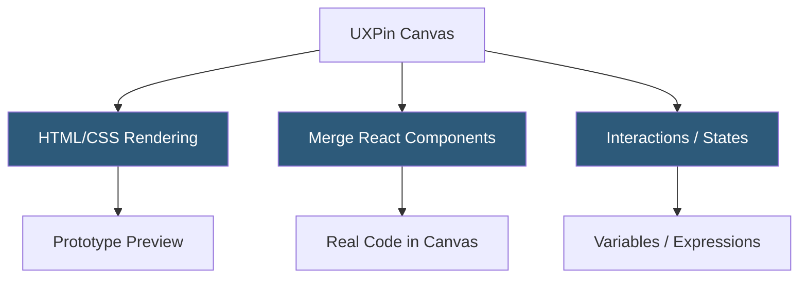

**Category:** UI/UX Design Platforms
**Difficulty:** Advanced
**Reading time:** 6 min read

---

UXPin is a design tool that bridges design and development by enabling interactive prototyping with real HTML/CSS rendering, conditional logic, and—through UXPin Merge—actual React components from a codebase displayed directly on the design canvas.

- **Interactions** — event-triggered state changes with conditional logic, variables, and JavaScript expressions
- **States** — component state variants with transitions defining multi-state UI behavior
- **Variables** — global and component-level named values enabling stateful prototype logic
- **Expressions** — JavaScript-based formulas for dynamic value computation in interactions
- **Preview Mode** — browser preview rendering UXPin designs as real HTML/CSS with live interactivity
- **UXPin Merge** — feature syncing a production React component library to UXPin for design with real code components
- **Design Systems** — shared component libraries and style documentation managed within UXPin

UXPin renders the design canvas using real HTML and CSS rather than proprietary rendering. Elements placed on the canvas generate actual DOM nodes styled with CSS. This means UXPin prototypes render in browser preview with real HTML semantics—buttons are `<button>` tags, inputs are `<input>` elements with real focus and keyboard behavior. This creates prototype fidelity that Figma and Sketch cannot achieve with their custom renderers.

Interactions in UXPin support complex conditional logic. An interaction can evaluate `IF [variable] == "premium" THEN show element A ELSE show element B`. Variables store user input from form fields, click counts, or explicitly set values. Expressions compute dynamic values using JavaScript syntax: `Math.round(price * taxRate)` calculates a total in a checkout prototype. This level of logic is comparable to ProtoPie's capabilities but within a design tool rather than a separate application.

UXPin Merge is the platform's unique differentiator. Engineering teams configure a Merge connection pointing to their npm package or GitHub repository of React components. UXPin fetches the components, renders them on the design canvas, and exposes their real React props as configuration panels. Designers place actual `<Button variant="primary" size="lg">` from the engineering codebase rather than Figma representations. Changes to the real components automatically propagate to UXPin designs after re-sync.

This creates genuine design-development alignment: the prototype and the production app use identical components. Designers cannot accidentally design with a button that doesn't exist in code, and engineers receive designs guaranteed to be implementable with the existing component library.

- Design systems teams wanting to close the design-code gap with real component prototyping
- Enterprise applications where prototype behavior must match production application logic
- Teams using UXPin Merge to eliminate "designed vs. built" discrepancy
- Accessibility testing with real semantic HTML for screen reader testing
- Complex form prototyping with real input behavior and validation

| Advantage | Disadvantage |
|-----------|--------------|
| Real HTML rendering enables authentic prototype fidelity | Steeper learning curve than visual-first tools like Figma |
| Merge syncs real production components for design accuracy | Merge setup requires engineering team involvement and maintenance |
| Conditional logic handles complex application state scenarios | Performance can lag with many complex interaction-heavy components |
| JavaScript expressions enable dynamic computed value prototyping | Smaller community and plugin ecosystem than Figma |

- [UXPin Merge Design-to-Code](uxpin-merge-design-to-code.md)
- [Axure RP Prototyping](axure-rp-prototyping.md)
- [Figma Design Systems](figma-design-systems.md)

---
*Part of the [UI/UX Design Platforms](index.md) category · [Back to Master Index](../../index.md)*
