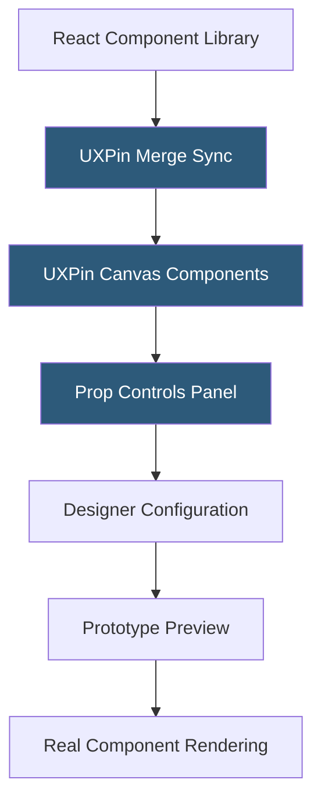

**Category:** UI/UX Design Platforms
**Difficulty:** Advanced
**Reading time:** 6 min read

---

UXPin Merge is a technology that synchronizes a production React component library with the UXPin design canvas, enabling designers to build prototypes using the exact same code components that engineers ship to production. It eliminates the gap between design representations and real implementations.

- **Component Sync** — automated pull of React components from npm packages or GitHub repositories into UXPin
- **Prop Controls** — auto-generated design canvas panels exposing component props as configuration inputs
- **Storybook Integration** — Merge can source components from a Storybook instance rather than direct npm
- **Design Token Binding** — design tokens from the codebase reflected in UXPin's style controls
- **Version Management** — Merge tracks component library versions, alerting designers to available updates
- **No-Code Component Use** — designers configure production components through props without writing JSX
- **Merge Code Editor** — optional in-canvas code editing for teams wanting code-level prop setting

UXPin Merge is configured by engineering teams using the `@uxpin/merge-cli` command-line tool. The CLI is run against a React component library package, generating a UXPin configuration that maps each exported component's TypeScript prop types to UXPin control types: string → text input, boolean → toggle, enum → dropdown, number → slider. This mapping is declarative through a `uxpin.config.js` file.

Once configured and deployed (either to UXPin's cloud or a private Git integration), component bundles are pulled into the UXPin workspace. Designers see the imported components in their design system panel. Placing a `<Button>` from Merge on the canvas renders the actual React component using a browser-based renderer that runs the real component code. The resulting visual is pixel-identical to production—because it is the production component.

Storybook integration is an alternative configuration path: Merge can parse a running Storybook instance to extract component definitions, leveraging the engineering team's existing documentation format rather than requiring separate Merge configuration. Components with Storybook stories and controls automatically have those controls mapped to UXPin prop panels.

The primary workflow impact is eliminating design-development discrepancy during sprint reviews. When a designer presents a prototype built with Merge components, engineers inspect it knowing every component already exists in the codebase with exactly those behaviors. Sprint scope becomes clearer: "build this flow" with Merge-designed prototypes means assembling existing components rather than building from scratch.

- Enterprise product teams validating sprint backlog with exact production component prototypes
- Design system teams demonstrating how components behave across different prop combinations
- Developer handoff elimination for teams using a comprehensive React component library
- Accessibility audit prototypes using semantic HTML components rather than design representations
- New designer onboarding through hands-on use of the engineering component system

| Advantage | Disadvantage |
|-----------|--------------|
| Eliminates design-code gap by using identical components | Requires engineering investment to configure and maintain Merge sync |
| Designers cannot over-design; constrained to existing components | Only works with React; Vue, Angular teams need different solutions |
| Prototype review doubles as component behavior testing | Breaking changes in component library break Merge designs |
| Automatic component prop documentation reduces spec writing | Complex components with render-side effects may behave unexpectedly in canvas |

- [UXPin Design Platform](uxpin-design-platform.md)
- [Figma Design Systems](figma-design-systems.md)
- [Figma Dev Mode](figma-dev-mode.md)

---
*Part of the [UI/UX Design Platforms](index.md) category · [Back to Master Index](../../index.md)*
