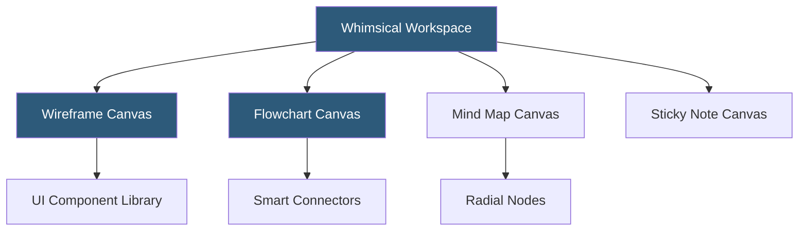

**Category:** UI/UX Design Platforms
**Difficulty:** Beginner
**Reading time:** 5 min read

---

Whimsical is a collaborative web-based workspace combining wireframing, flowcharting, mind mapping, and sticky note tools in a single infinite canvas application. Its polished aesthetic and minimal interface make it popular for early-stage UX design, product planning, and team alignment workshops.

- **Wireframes** — mid-fidelity component-based wireframing with a curated set of pre-built UI elements
- **Flowcharts** — smart-connected diagram shapes with auto-routing arrows for user flow and process documentation
- **Mind Maps** — radial idea mapping with keyboard-driven child node creation for brainstorming
- **Sticky Notes** — color-coded note cards for collaborative ideation with grouping and voting
- **Smart Connectors** — arrows that intelligently reroute when connected objects are moved
- **Templates** — built-in templates for common outputs (user journeys, ERDs, site maps, retrospectives)
- **Team Workspaces** — folder-organized project spaces with member access control and file sharing

Whimsical organizes its canvas into distinct tool modes—Wireframes, Flowcharts, Mind Maps, Docs—accessible as separate file types within a workspace. This separation keeps toolsets focused: the wireframe canvas shows UI component palettes, while the flowchart canvas shows shape libraries appropriate for process diagrams.

Wireframe components cover standard UI patterns: navigation bars, form fields, buttons, cards, modals, tables, and mobile device frames. Components are placed by dragging from the panel or typing their name in a quick-insert field. All components follow Whimsical's consistent visual style—clean, medium-fidelity grayscale that communicates structure without implying final visual design decisions.

Smart connectors in flowcharts automatically calculate the optimal route between shapes. When a shape is moved, connected arrows reroute automatically without requiring manual redrawing. Arrow labels, line styles (solid, dashed), and arrowhead types distinguish normal flows from conditional branches and error paths. Shapes snap to grid alignment with configurable spacing.

Mind maps use a keyboard-driven creation model: pressing Tab creates a child node, Enter creates a sibling node. This enables rapid capture of branching ideas without mouse movement. The radial layout auto-arranges nodes as the map grows, though manual repositioning is available. Mind maps can export as structured outlines or be embedded in Whimsical Docs alongside flowchart and wireframe files.

- Product managers creating user journey maps and feature flowcharts
- UX designers sketching mid-fidelity wireframe flows for concept validation
- Engineering teams diagramming API and data architecture flows
- Remote teams running collaborative brainstorming and retrospective sessions
- Content strategists mapping site architecture and navigation hierarchies

| Advantage | Disadvantage |
|-----------|--------------|
| Clean visual style produces polished mid-fidelity outputs quickly | Less powerful than Figma for detailed visual design or component systems |
| Multi-tool workspace reduces context switching between apps | Real-time collaboration present but less polished than Figma or Miro |
| Smart connector auto-routing reduces diagramming maintenance effort | Limited export options compared to Lucidchart or draw.io |
| Free plan provides substantial functionality for individuals | Storage limits on free plan restrict large project accumulation |

- [Overflow User Flow Diagrams](overflow-user-flow-diagrams.md)
- [Miro Collaborative Whiteboard](miro-collaborative-whiteboard.md)
- [Balsamiq Wireframing](balsamiq-wireframing.md)

---
*Part of the [UI/UX Design Platforms](index.md) category · [Back to Master Index](../../index.md)*
