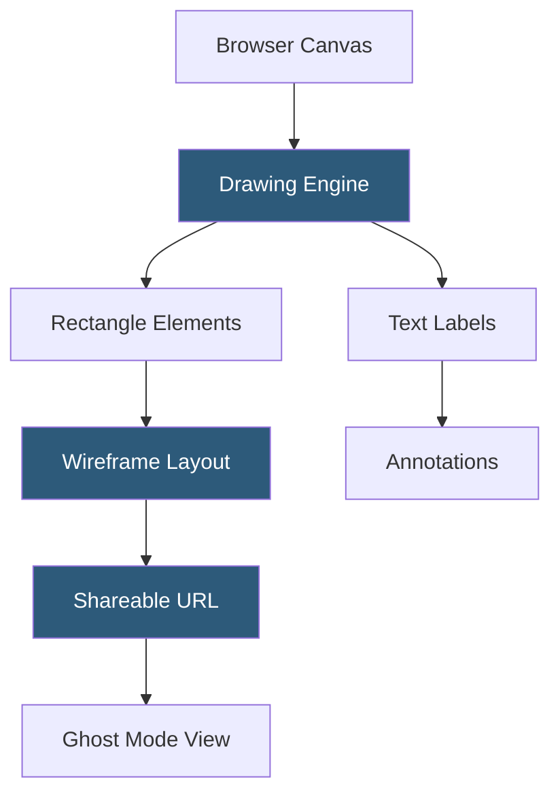

**Category:** UI/UX Design Platforms
**Difficulty:** Beginner
**Reading time:** 5 min read

---

Wireframe.cc is a minimalist online wireframing tool that reduces UI design to its simplest possible form: drawing rectangles and adding text on a white canvas. Its extreme simplicity makes it ideal for capturing quick layout concepts, communicating structural ideas in meetings, or producing no-frills wireframes when speed matters more than detail.

- **Zero-Friction Canvas** — canvas begins blank with no component library; users draw directly by clicking and dragging
- **Gestural Drawing** — left-click drag creates rectangles; right-click opens a context menu for element properties
- **Text Annotation** — double-clicking any drawn element opens an inline text editor for labeling
- **Minimal Color Palette** — limited grayscale color options enforce focus on layout rather than color decisions
- **Shareable Links** — wireframes saved as public URLs shareable without account creation
- **Ghost Mode** — read-only collaboration mode allowing teammates to view wireframes in real time
- **Minimalist Philosophy** — intentional feature limitation to prevent scope creep in early design phases

Wireframe.cc's entire interface is a blank canvas in the browser. The tool has no component library, no toolbar, and no menus until the user right-clicks. Drawing begins by left-click-dragging on the canvas—a rectangle is created proportional to the drag dimensions. The right-click context menu provides options to add text, change the element's color (from a grayscale set), layer order, and delete.

The simplicity is intentional. Without pre-designed components, users must consciously decide what each rectangle represents. This forces communication: annotating a rectangle as "Navigation bar" or "Product image" makes the structural intent explicit in the wireframe itself, rather than relying on familiar visual patterns from component libraries.

Shareable links work by saving wireframe data as JSON to a server and generating a unique URL. The link opens the wireframe at its last saved state. No account is required for basic usage. Ghost Mode generates a separate view URL that displays the wireframe in real time as the creator edits, enabling remote screen-share-free collaboration for quick design discussions.

The tool's output is intentionally impermanent—wireframes exist as URLs rather than files. This positions Wireframe.cc as a communication tool for the moment a layout concept needs to be captured and shared, not a persistent design repository. Users who need to iterate significantly typically export images and move to a more capable tool.

- Capturing a layout idea during a discovery meeting in real time
- Quick structural sketches shared via URL in Slack or email
- Remote brainstorming sessions showing proposed screen structure
- Developer conversations about layout intent during sprint planning
- Low-commitment first-pass wireframes before investing in Figma or Balsamiq

| Advantage | Disadvantage |
|-----------|--------------|
| Zero setup time; open browser and start drawing immediately | No component library; must draw every element from scratch |
| Shareable URL without account or download friction | No versioning or revision history |
| Extreme simplicity prevents over-investment in throwaway concepts | Cannot export to formats compatible with design tools |
| Free for basic use with no sign-up requirement | Wireframes public by default unless using paid private mode |

- [Balsamiq Wireframing](balsamiq-wireframing.md)
- [Whimsical Wireframes and Diagrams](whimsical-wireframes-diagrams.md)
- [Excalidraw Collaborative Sketching](excalidraw-collaborative-sketching.md)

---
*Part of the [UI/UX Design Platforms](index.md) category · [Back to Master Index](../../index.md)*
