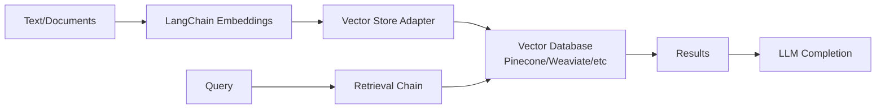

**Category:** Vector Database Ecosystem
**Difficulty:** Intermediate
**Reading time:** 6 min read

---

This lesson covers LangChain vector store integrations, exploring how LangChain simplifies the integration of vector databases into language model applications. LangChain provides a unified interface for working with multiple vector databases, enabling seamless switching and hybrid approaches.

- **Vector Store Interface** — Unified abstraction across different vector databases
- **Embedding Integration** — Automatic embedding generation and storage
- **Retrieval Chains** — Ready-to-use chains for semantic search and RAG
- **Multi-Database Support** — Seamless integration with 30+ vector databases
- **LLM Chaining** — Integration with language models for end-to-end applications

LangChain provides vector store integrations through a standardized interface that abstracts away database-specific details. When adding documents, LangChain handles embedding generation, chunking, and storage. The VectorStore base class defines common operations like add_texts, search, and similarity_search_with_score. LangChain manages connections, batch operations, and error handling across different vector database APIs. For retrieval, LangChain provides chains that orchestrate query embedding, similarity search, and result ranking. The abstraction allows applications to change vector databases with minimal code changes, supporting cost optimization and performance tuning strategies.

- Building semantic search applications
- Implementing Retrieval-Augmented Generation (RAG) systems
- Creating conversational AI with long-context memory
- Multi-language document search systems
- Knowledge base question answering systems
- Hybrid search combining vector and keyword search

| Advantage | Disadvantage |
|-----------|--------------|
| Unified interface across databases | Abstraction may hide database-specific optimizations |
| Rapid prototyping and iteration | Some advanced features unavailable through interface |
| Database agnostic development | Requires learning LangChain abstractions |

- [LangChain retrievers](langchain-retrievers.md)
- [LlamaIndex vector stores](llamaindex-vector-stores.md)
- [Anthropic Claude with RAG](anthropic-claude-with-rag.md)

---
*Part of the [Vector Database Ecosystem](vector-database-ecosystem/index.md) category · [Back to Master Index](../../index.md)*
