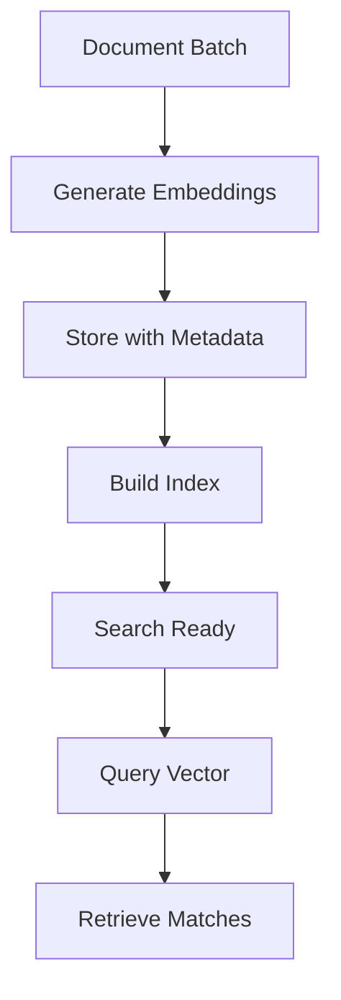

**Category:** Vector Database Platforms
**Difficulty:** Intermediate
**Reading time:** 6 min read

---

txtai embeddings database is a lightweight vector storage solution that manages embedding vectors and their metadata. It provides efficient indexing and retrieval of vector data without requiring external infrastructure.

- **Embedding Store** — central repository for vector embeddings
- **Metadata Management** — associating text and attributes with vectors
- **Index Types** — different indexing strategies for speed vs accuracy
- **Document Retrieval** — finding source documents from vectors
- **Batch Operations** — efficient processing of multiple embeddings

The embeddings database accepts documents and generates vector embeddings using configured embedding models. Each embedding is stored alongside original text and metadata, enabling retrieval of source content. The index is built automatically and supports multiple strategies including dense vectors for exact storage and approximate nearest neighbor for fast approximate search. Updates to documents trigger automatic re-indexing. The system maintains relationships between embeddings and original content, allowing reconstruction of documents from search results.

- Semantic document storage
- Embedding vector management
- Hybrid search combining vectors and text
- ML training data organization
- Knowledge base infrastructure
- Multimodal content indexing
- Application embedding caching

| Advantage | Disadvantage |
|-----------|--------------|
| All-in-one embedding and storage solution | Limited to txtai ecosystem |
| Automatic metadata management | Scaling requires careful planning |
| No external database needed | In-memory indexing limits dataset size |
| Simple API for common operations | Limited advanced query capabilities |
| Good for prototyping and small scale | Production features require tuning |

- [Embedding models](embedding-models.md)
- [Vector indexing](vector-indexing.md)
- [Metadata storage](metadata-storage.md)

---
*Part of the [Vector Database Platforms](vector-database-platforms/index.md) category · [Back to Master Index](../../index.md)*
