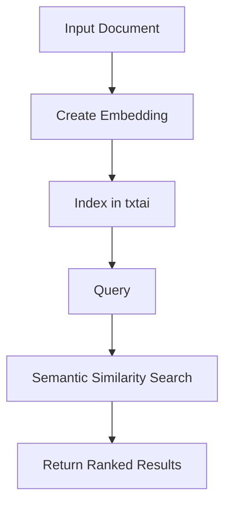

**Category:** Vector Database Platforms
**Difficulty:** Intermediate
**Reading time:** 6 min read

---

txtai is an open-source semantic search engine that uses embeddings to enable intelligent, context-aware searching across documents and data. It provides fast similarity search capabilities optimized for vector operations.

- **Semantic Search** — searching based on meaning rather than keyword matching
- **Embeddings** — vector representations of text that capture semantic meaning
- **Vector Database** — specialized database designed for fast similarity queries
- **RAG Pipeline** — Retrieval-Augmented Generation combining search with language models
- **Approximate Nearest Neighbor** — fast algorithm for finding similar vectors

txtai converts documents into semantic embeddings using pre-trained transformer models, then stores these vectors in an optimized index. When a query arrives, it's converted to the same embedding space and compared against indexed documents using distance metrics like cosine similarity. The engine returns documents ranked by semantic relevance. txtai supports multiple backends including SQLite for lightweight deployments and cloud solutions for scale. The framework handles indexing, querying, and relevance ranking automatically, making semantic search accessible without deep ML expertise.

- Document search and discovery
- FAQ systems with semantic matching
- Content recommendation engines
- Legal document analysis
- Scientific paper discovery
- Customer support knowledge bases
- Information retrieval systems

| Advantage | Disadvantage |
|-----------|--------------|
| Fast semantic search without complex setup | Embedding quality depends on model choice |
| Lightweight and easy to deploy | Requires appropriate compute for indexing |
| No external dependencies for basic usage | Limited to text-based search by default |
| Excellent for RAG applications | Scaling to billions of documents has limits |
| Active community and good documentation | Model updates require full re-indexing |

- [Vector databases](../index.md)
- [Embedding models](embedding-models.md)
- [Semantic similarity](semantic-similarity.md)

---
*Part of the [Vector Database Platforms](vector-database-platforms/index.md) category · [Back to Master Index](../../index.md)*
