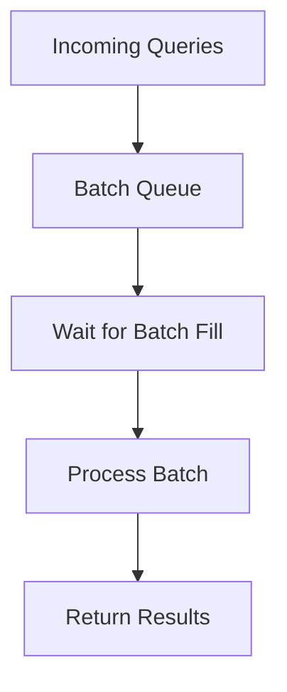

**Category:** Vector Search Optimization
**Difficulty:** Intermediate
**Reading time:** 6 min read

---

Batch query processing groups multiple vector search requests together for simultaneous processing, amortizing overhead and enabling SIMD and GPU acceleration. Processing queries in batches improves overall throughput compared to sequential processing, though individual queries may experience higher latency. Batch processing is essential for high-throughput systems and GPU-accelerated search.

- **Query Batching** — grouping multiple queries for simultaneous processing
- **Vectorization** — using SIMD to process multiple queries with one operation
- **Latency vs Throughput** — tradeoff between individual request latency and overall system throughput
- **Batch Size Tuning** — optimal grouping size depends on hardware and overhead
- **Adaptive Batching** — dynamically adjusting batch sizes based on load

Instead of processing queries one at a time, batch processing accumulates multiple queries into a buffer before execution. The batch is then processed collectively, allowing vectorized operations to amortize overhead. For GPU processing, transferring multiple queries in one operation is far more efficient than individual transfers. SIMD operations can compute distances for multiple queries simultaneously. Batch size affects the latency-throughput tradeoff: larger batches achieve higher throughput but mean queries must wait longer for batch completion. Adaptive batching adjusts batch size based on query arrival rate—when traffic is light, smaller batches keep latency low; when traffic is heavy, larger batches improve throughput.

- High-throughput batch inference
- Analytics and reporting queries
- Off-peak data processing
- GPU-accelerated search
- Multi-user systems
- Cloud-scale vector search
- Stream processing scenarios
- Cost-optimized indexing

| Advantage | Disadvantage |
|-----------|--------------|
| Higher overall throughput | Individual query latency increases |
| Efficient GPU/SIMD usage | Requires query buffering |
| Amortizes overhead | Complexity in batching logic |
| Improves hardware utilization | May not suit interactive use cases |
| Scalability improvements | Potential tail latency issues |

- [Throughput Optimization](throughput-optimization.md)
- [GPU Acceleration for Indexing](gpu-acceleration-for-indexing.md)
- [Query Latency Optimization](query-latency-optimization.md)

---
*Part of the [Vector Search Optimization](index.md) category · [Back to Master Index](../../index.md)*
