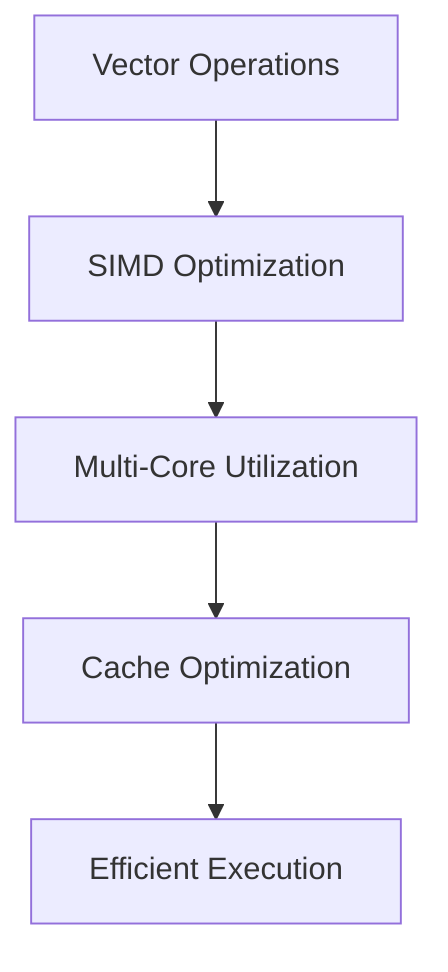

**Category:** Vector Search Optimization
**Difficulty:** Intermediate
**Reading time:** 6 min read

---

CPU utilization tuning optimizes vector search systems to efficiently use available processor cores and instruction sets. Strategies include SIMD vectorization, multi-threading, algorithmic efficiency improvements, and hardware-specific optimizations. Proper CPU utilization enables serving higher query throughput or reducing latency on given hardware.

- **SIMD Vectorization** — using vector instructions for parallel computation
- **Multi-Threading** — distributing queries across CPU cores
- **Cache Locality** — optimizing memory access patterns for CPU caches
- **Branch Prediction** — minimizing expensive branch mispredictions
- **Instruction Pipelining** — organizing code for efficient CPU execution

Modern CPUs execute vector operations most efficiently using SIMD (Single Instruction Multiple Data) instructions that operate on multiple data elements simultaneously. Distance calculations between vectors (the core operation in vector search) can be parallelized using AVX-512, SSE, or NEON instructions, achieving multiple-fold speedup. Multi-threading distributes multiple queries across CPU cores, enabling true parallelism on multi-core systems. Cache efficiency matters significantly: accessing data in sequential memory patterns rather than random patterns enables CPU caching to be effective. Branch mispredictions are minimized by organizing code to have predictable control flow. Compiler optimizations and hand-tuned code can extract substantial performance improvements.

- High-throughput search systems
- Latency-sensitive applications
- CPU-constrained deployments
- On-premises infrastructure
- Optimizing total query cost
- Real-time ranking systems
- Recommendation engine backends
- Cost-effective cloud deployments

| Advantage | Disadvantage |
|-----------|--------------|
| Leverages modern CPU capabilities | Requires specific hardware features |
| Multi-threading enables scaling | Synchronization overhead |
| Cache optimization improves speed | Complex to optimize correctly |
| SIMD provides major speedups | Requires algorithmic knowledge |
| Compiler optimizations are automatic | Results vary by CPU model |

- [GPU Acceleration for Indexing](gpu-acceleration-for-indexing.md)
- [Throughput Optimization](throughput-optimization.md)
- [Query Latency Optimization](query-latency-optimization.md)

---
*Part of the [Vector Search Optimization](index.md) category · [Back to Master Index](../../index.md)*
