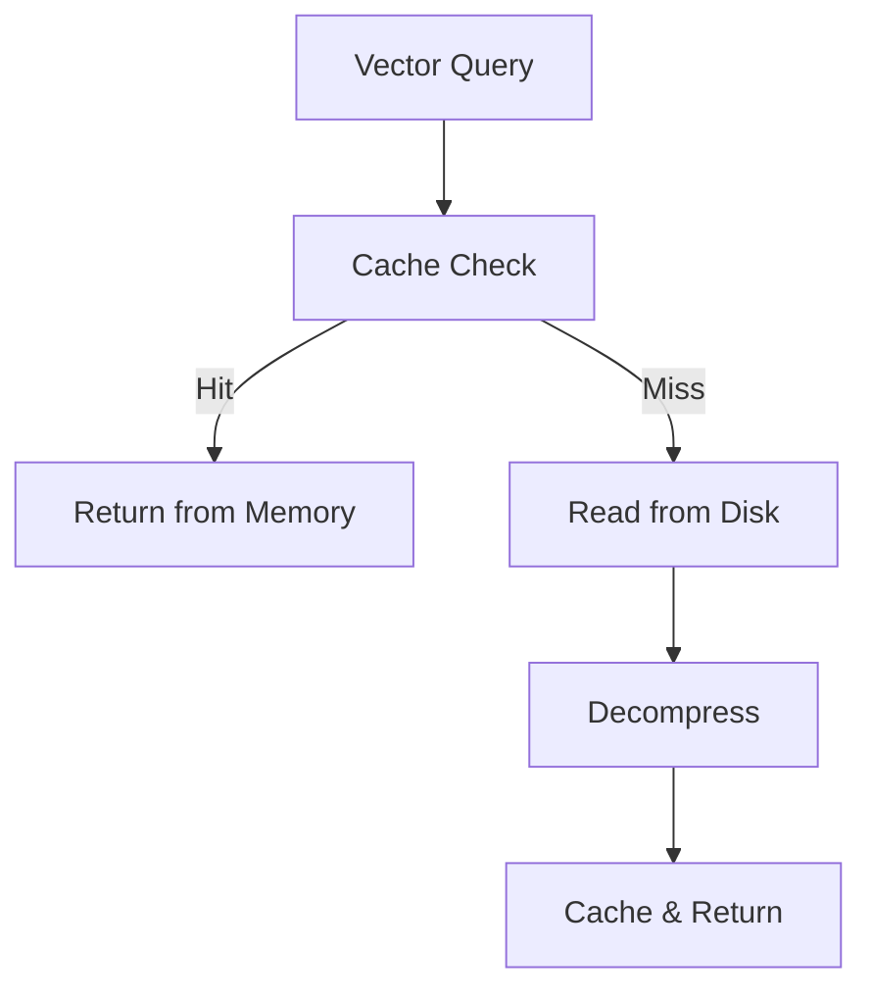

**Category:** Vector Search Optimization
**Difficulty:** Intermediate
**Reading time:** 6 min read

---

Disk I/O optimization addresses the challenge of efficiently accessing vector data stored on disk when datasets exceed available memory. Techniques include sequential access patterns, compression, caching hot data in memory, and leveraging modern storage hardware. Minimizing disk I/O latency is critical for systems serving large-scale vector searches from persistent storage.

- **Sequential Access Patterns** — organizing data to enable efficient disk reads
- **Compression** — reducing data size to minimize I/O overhead
- **Caching Strategies** — keeping hot vectors in memory
- **Read-Ahead** — prefetching likely-needed data
- **SSD Optimization** — leveraging IOPS and throughput characteristics

When vector datasets exceed available RAM, disk I/O becomes a bottleneck. Optimization strategies cluster related vectors together on disk to enable sequential reads of multiple vectors with single I/O operations. Compression reduces data size, requiring fewer bytes per I/O operation. Predictive caching loads vectors likely to be accessed soon into memory ahead of actual queries. Modern systems use LRU caches to keep frequently accessed vectors in RAM while less-hot data remains on disk. SSD technology provides faster random access than traditional spinning disks, reducing latency for non-sequential access patterns. Batching queries enables amortizing I/O overhead across multiple requests.

- Extremely large vector datasets (petabyte scale)
- Archive search over historical data
- Periodic batch indexing and search
- Cost-sensitive storage with slower access
- Hybrid RAM-disk architectures
- Managed cloud storage integrations
- Long-term data retention scenarios
- Backup and recovery operations

| Advantage | Disadvantage |
|-----------|--------------|
| Enables larger-than-RAM datasets | Slower than in-memory access |
| Compression reduces storage costs | Decompression overhead |
| Caching improves repeat queries | Cache invalidation complexity |
| SSDs improve I/O performance | Higher per-GB cost than HDD |
| Batching amortizes overhead | Potentially higher latency |

- [Caching Frequent Queries](caching-frequent-queries.md)
- [Memory Usage Optimization](memory-usage-optimization.md)
- [Bulk Vector Loading](bulk-vector-loading.md)

---
*Part of the [Vector Search Optimization](index.md) category · [Back to Master Index](../../index.md)*
