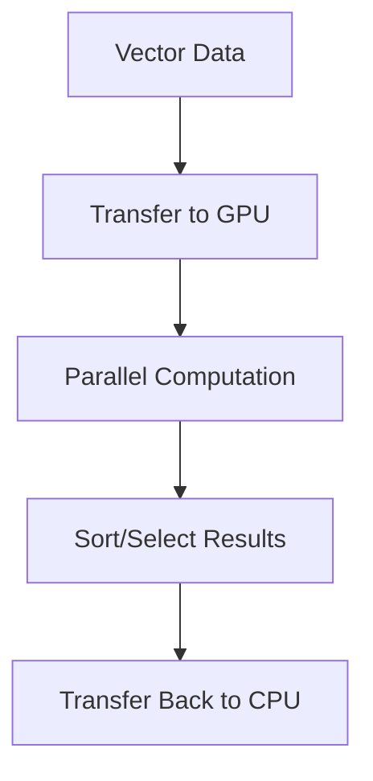

**Category:** Vector Search Optimization
**Difficulty:** Intermediate
**Reading time:** 6 min read

---

GPU acceleration leverages graphics processors to dramatically speed up vector index building and searching. GPUs excel at massively parallel operations like distance calculations and sorting, enabling orders-of-magnitude improvements in performance. GPU acceleration is particularly valuable for large-scale indexing and high-throughput search workloads.

- **Parallel Distance Computation** — calculating distances for thousands of vectors simultaneously
- **GPU Memory** — managing data transfer between CPU and GPU
- **CUDA/OpenCL** — programming frameworks for GPU acceleration
- **Batching for GPU** — organizing queries for GPU processing efficiency
- **Cost vs Benefit** — GPU costs vs performance improvements

GPUs contain thousands of simple cores optimized for parallel arithmetic operations. Building vector indexes and searching involve massive numbers of distance calculations that naturally parallelize across GPU cores. GPUs can compute distances from a query vector to thousands of candidate vectors simultaneously, orders of magnitude faster than sequential CPU execution. However, GPU acceleration introduces data transfer overhead—vectors must be moved from CPU memory to GPU memory (over PCIe bus). Efficient GPU usage requires batch processing to amortize transfer overhead. Programming GPUs requires CUDA (for NVIDIA) or OpenCL, adding development complexity. GPU acceleration is most effective for scenarios with high computational intensity where transfer costs are amortized.

- Large-scale index construction
- Batch query processing
- Real-time search on massive datasets
- Scientific computing with embeddings
- Similarity search in high dimensions
- Clustering operations on embeddings
- Training deep learning models with vectors
- Data center-scale vector search

| Advantage | Disadvantage |
|-----------|--------------|
| Orders of magnitude speedup possible | GPU acquisition and power costs |
| Massively parallel computation | Data transfer overhead |
| Enables billion-scale search | Requires specialized programming |
| Cost-effective at scale | Availability constraints |
| Powers cutting-edge ML | Complexity in deployment |

- [Throughput Optimization](throughput-optimization.md)
- [Batch Query Processing](batch-query-processing.md)
- [CPU Utilization Tuning](cpu-utilization-tuning.md)

---
*Part of the [Vector Search Optimization](index.md) category · [Back to Master Index](../../index.md)*
