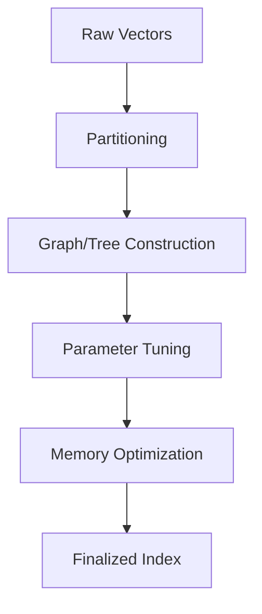

**Category:** Vector Search Optimization
**Difficulty:** Intermediate
**Reading time:** 6 min read

---

Index building optimization focuses on efficiently constructing approximate nearest neighbor (ANN) indexes from large vector datasets. Techniques include selecting optimal indexing algorithms, tuning construction parameters, managing memory during building, and leveraging parallel processing to reduce the time and resources required to create production-ready vector indexes.

- **ANN Algorithm Selection** — choosing between HNSW, IVF, LSH, or tree-based approaches
- **Construction Parameters** — tuning layer counts, fanout, beam width, and partition counts
- **Memory Management** — streaming index construction to handle datasets larger than RAM
- **Parallelization** — multi-threaded or distributed building across compute clusters
- **Incremental Building** — adding vectors to existing indexes without full reconstruction

Vector index construction begins with raw embedding data that may be stored on disk or in a data warehouse. The building process typically involves partitioning the vector space into regions, constructing hierarchical structures (graphs, trees, or quantized spaces), and optimizing index parameters for query performance and memory usage. Modern approaches support streaming construction where vectors are processed in batches rather than loaded entirely into memory, enabling scaling to billions of vectors. Parallel processing across multiple cores or machines accelerates construction. Once built, indexes may support incremental updates without full reconstruction, though rebuild frequency affects optimal parameters.

- Building initial production indexes from static datasets
- Regular index reconstruction with new data
- Distributed index construction across clusters
- Memory-constrained index building environments
- High-throughput embedding ingestion scenarios
- Optimizing for specific query latency/accuracy targets
- Handling datasets too large for single-machine RAM
- Tuning for specific hardware characteristics

| Advantage | Disadvantage |
|-----------|--------------|
| Batch building enables large datasets | Construction is offline (no real-time indexing) |
| Optimized parameters for target latency | Parameter tuning requires experimentation |
| Efficient memory utilization possible | Trade-offs between build time and index quality |
| Parallel construction reduces build time | Distribution adds operational complexity |
| Incremental building flexibility | May require periodic full rebuilds |

- [Incremental Indexing](incremental-indexing.md)
- [Bulk Vector Loading](bulk-vector-loading.md)
- [Index Size vs Accuracy Tradeoffs](index-size-vs-accuracy-tradeoffs.md)

---
*Part of the [Vector Search Optimization](index.md) category · [Back to Master Index](../../index.md)*
