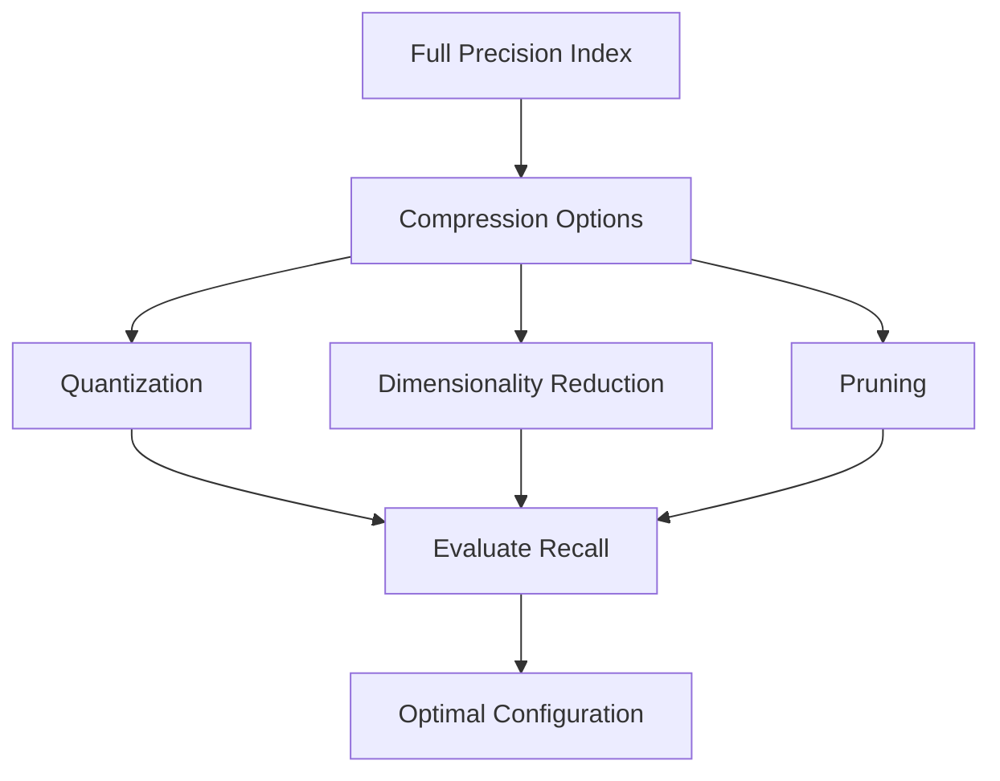

**Category:** Vector Search Optimization
**Difficulty:** Intermediate
**Reading time:** 6 min read

---

Index size versus accuracy tradeoffs involve balancing memory consumption and storage requirements against recall and precision in vector search results. Techniques like quantization, pruning, and dimensionality reduction reduce index size while potentially impacting result quality. Understanding these tradeoffs enables optimal index configuration for specific use cases, hardware constraints, and accuracy requirements.

- **Memory Footprint** — total index size in memory or storage
- **Recall vs Size** — accuracy loss as index size decreases
- **Quantization Impact** — reducing precision of vector values
- **Pruning Trade-offs** — removing graph edges or nodes affects search quality
- **Dimensionality Impact** — fewer dimensions reduce storage but may hurt accuracy

Original vector indexes store full-precision embeddings (32-bit or 64-bit floats), resulting in large memory requirements. Optimization techniques reduce size by storing quantized values (8-bit or 4-bit integers), reducing the number of dimensions, or removing less-critical graph connections. Each technique has measurable impact on recall—fewer bits or dimensions means more quantization error, while pruning reduces neighbor connectivity. Testing different configurations reveals the pareto frontier where additional space savings cause unacceptable accuracy loss. Optimal configuration depends on use case tolerance for false negatives, available memory, and query throughput requirements.

- Mobile and edge device deployments
- Cost-sensitive deployments with memory constraints
- High-throughput scenarios requiring reduced memory
- Cloud deployments where memory costs are significant
- Matching accuracy requirements to hardware resources
- Embedded search in resource-constrained environments
- Analyzing accuracy-space tradeoff curves
- Optimizing total cost of ownership

| Advantage | Disadvantage |
|-----------|--------------|
| Reduced memory enables larger datasets | Potential accuracy loss |
| Lower hardware costs and cloud spend | Complexity in tuning multiple parameters |
| Faster index loading and initialization | Trade-offs may be non-linear |
| Enables mobile and edge deployments | Difficult to predict exact impact |
| Can improve cache efficiency | May require custom implementations |

- [Quantization-Aware Training](quantization-aware-training.md)
- [Dimension Reduction Techniques](dimension-reduction-techniques.md)
- [Memory Usage Optimization](memory-usage-optimization.md)

---
*Part of the [Vector Search Optimization](index.md) category · [Back to Master Index](../../index.md)*
