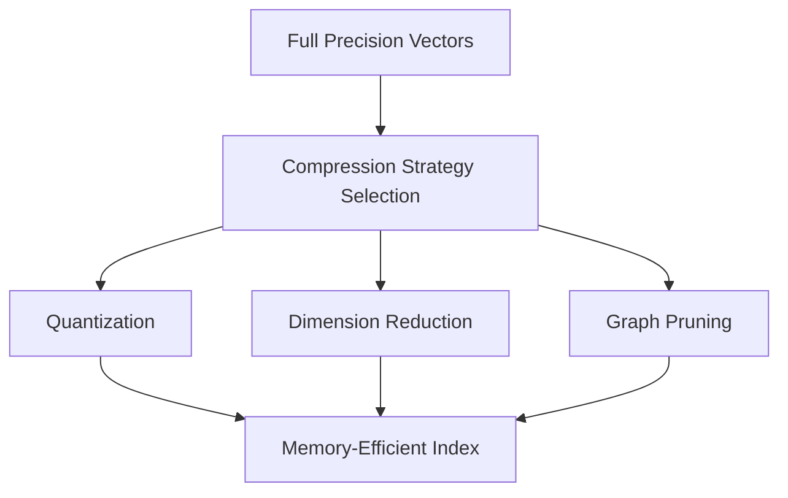

**Category:** Vector Search Optimization
**Difficulty:** Intermediate
**Reading time:** 6 min read

---

Memory usage optimization addresses the challenge of fitting large vector indexes into available RAM while maintaining query performance. Techniques include quantization, dimension reduction, pruning graph structures, and streaming processing. Effective memory optimization enables deploying vector search on resource-constrained devices or reduces infrastructure costs in cloud deployments.

- **Quantization** — reducing precision of stored vectors
- **Streaming Processing** — processing data in chunks rather than loading entirely
- **Memory-Mapped Files** — using OS page caching instead of explicit memory management
- **Graph Pruning** — removing less-critical connections in neighbor graphs
- **Hierarchical Compression** — different compression levels for different index levels

Original vector indexes store full-precision embeddings requiring 4-32 bytes per dimension per vector. For a billion 768-dimensional vectors, this exceeds multi-terabyte storage. Quantization reduces each dimension to 8 bits or fewer, compressing to 1-4 bytes per dimension. Dimension reduction techniques like PCA eliminate low-variance dimensions without losing significant information. Graph-based indexes can be pruned by removing edges to distant neighbors, reducing memory while maintaining connectivity. Memory-mapped files leverage OS paging to create the illusion of larger memory by transparently loading required pages from disk. The strategy depends on acceptable accuracy loss and performance targets.

- Mobile and embedded vector search
- Edge device deployments
- Cost-sensitive cloud deployments
- Single-machine deployments with large datasets
- IoT device inference
- Browser-based vector search
- Resource-constrained environments
- Multi-tenant shared infrastructure

| Advantage | Disadvantage |
|-----------|--------------|
| Reduces infrastructure costs | Potential accuracy degradation |
| Enables resource-constrained deployments | Quantization introduces error |
| Improves cache hit rates | Adds computational overhead |
| Extends battery life on mobile | May require custom implementations |
| Simplifies scaling architecture | Difficult to predict exact impact |

- [Quantization-Aware Training](quantization-aware-training.md)
- [Dimension Reduction Techniques](dimension-reduction-techniques.md)
- [Index Size vs Accuracy Tradeoffs](index-size-vs-accuracy-tradeoffs.md)

---
*Part of the [Vector Search Optimization](index.md) category · [Back to Master Index](../../index.md)*
