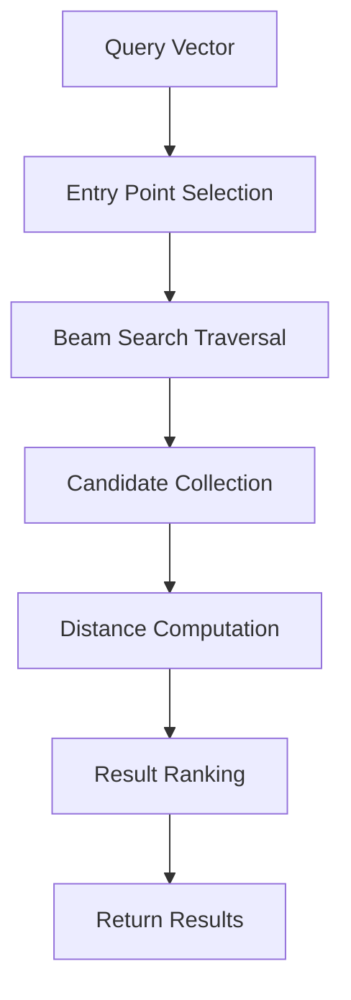

**Category:** Vector Search Optimization
**Difficulty:** Intermediate
**Reading time:** 6 min read

---

Query latency optimization focuses on reducing the time required to process and return vector search results. Strategies include algorithm selection, parameter tuning for speed over accuracy, caching, precomputation, and hardware acceleration. Achieving sub-millisecond latency requires careful balance between index structure, query processing algorithms, and infrastructure choices.

- **Search Beam Width** — number of candidates explored during traversal
- **Layer Navigation** — efficient graph layer exploration in hierarchical indexes
- **Candidate Refinement** — post-filter accuracy for initial results
- **CPU Cache Optimization** — memory access patterns affecting query speed
- **Early Termination** — stopping search when sufficient results found

Query latency optimization begins with algorithm selection—HNSW and IVF typically offer latency-accuracy tradeoffs suitable for most applications. The search process navigates through index structures using beam search or pruning to explore only the most promising candidates rather than exhaustive search. Beam width directly controls latency: wider beams are slower but more accurate, narrower beams are faster but may miss results. Candidate distance computations, the most expensive operation, are optimized through SIMD vectorization and algorithmic improvements. Early termination halts search when sufficient candidates are found. Caching frequently queried results or precomputing common transformations further reduces latency.

- Real-time semantic search applications
- Interactive chatbots and conversational AI
- Millisecond-latency recommendation systems
- Search-as-you-type functionality
- High-throughput multi-user systems
- Mobile and edge device searching
- User-facing search experiences
- Time-sensitive ranking systems

| Advantage | Disadvantage |
|-----------|--------------|
| Beam width tuning provides control | Reduces recall as latency decreases |
| Algorithm selection offers flexibility | Some approaches incompatible |
| Caching improves repeat queries | Cold start queries remain slow |
| Early termination reduces overhead | May miss optimal results |
| Hardware acceleration possible | Requires specialized hardware investment |

- [Throughput Optimization](throughput-optimization.md)
- [Caching Frequent Queries](caching-frequent-queries.md)
- [Warm vs Cold Query Performance](warm-vs-cold-query-performance.md)

---
*Part of the [Vector Search Optimization](index.md) category · [Back to Master Index](../../index.md)*
