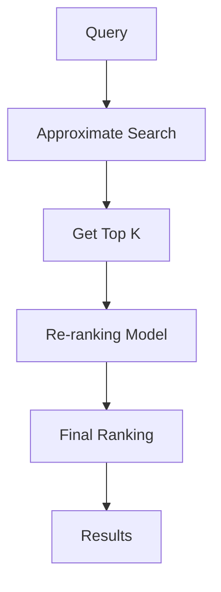

**Category:** Vector Search Optimization
**Difficulty:** Intermediate
**Reading time:** 6 min read

---

Re-ranking strategies apply more computationally expensive scoring functions to top candidates from initial vector search, improving result quality without performing expensive ranking on all candidates. Approaches include cross-encoder models, learning-to-rank, and multi-stage ranking pipelines. Re-ranking enables balancing speed and accuracy by using fast approximate search followed by precise ranking.

- **Two-Stage Ranking** — fast retrieval followed by expensive re-ranking
- **Cross-Encoders** — models that score query-document pairs directly
- **Learning-to-Rank** — machine learning models optimizing ranking quality
- **Feature Engineering** — combining multiple signals for ranking
- **Online vs Offline** — ranking optimization timing

Re-ranking addresses the fundamental tradeoff between speed and accuracy in vector search. Initial vector search is fast because it uses approximate indexes with relaxed accuracy constraints. The top K candidates are then scored using more expensive but accurate models: cross-encoder neural networks, gradient boosted trees, or handcrafted feature-based scoring. These re-ranking models can incorporate additional signals beyond vector similarity (click-through rates, freshness, quality signals). Learning-to-rank approaches optimize ranking models using labeled datasets where relevance is known. The two-stage approach is effective when K (initial results) is much smaller than total database size, amortizing expensive ranking computation.

- E-commerce product ranking
- Search engine result ranking
- Recommendation system refinement
- Information retrieval optimization
- Personalized result ranking
- Click prediction and ranking
- Document relevance ranking
- Query answer ranking

| Advantage | Disadvantage |
|-----------|--------------|
| Leverages fast approximate search | Additional compute cost |
| Improves result quality significantly | Model training overhead |
| Enables precise ranking on subset | Complexity in two-stage architecture |
| Multiple ranking signals possible | Latency from re-ranking |
| Optimizable via learning-to-rank | May require labeled data |

- [Coarse-to-Fine Search](coarse-to-fine-search.md)
- [Multi-Stage Retrieval](multi-stage-retrieval.md)
- [Hybrid Search (Keyword + Vector)](hybrid-search-keyword-vector.md)

---
*Part of the [Vector Search Optimization](index.md) category · [Back to Master Index](../../index.md)*
