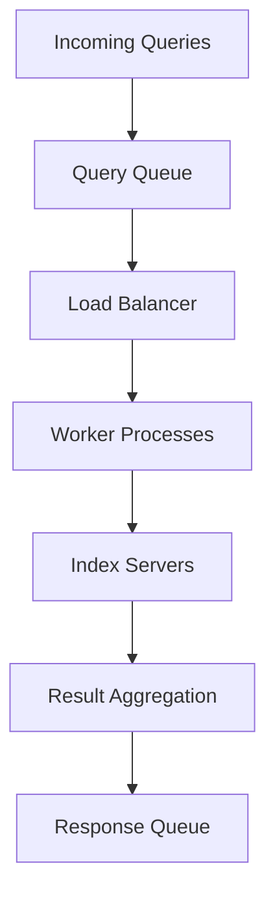

**Category:** Vector Search Optimization
**Difficulty:** Intermediate
**Reading time:** 6 min read

---

Throughput optimization focuses on maximizing the number of queries processed per unit time, enabling vector search systems to handle high-volume concurrent request loads. Strategies include batch query processing, parallel computation, connection pooling, and load balancing. Achieving high throughput requires careful resource allocation and architectural design to prevent bottlenecks at any layer.

- **Batch Processing** — processing multiple queries simultaneously
- **Parallelization** — multi-threaded or multi-process query handling
- **Connection Pooling** — reusing database connections
- **Load Balancing** — distributing queries across multiple servers
- **Resource Saturation** — balancing CPU, memory, and I/O resources

High-throughput systems typically employ a multi-layer architecture: incoming requests are queued and load-balanced across multiple worker processes or containers. Each worker maintains connections to index servers and processes batches of queries in parallel using thread pools or async frameworks. Batch processing allows vectorized operations where multiple queries leverage the same computational resources. Connection pooling reduces overhead from establishing new connections. The system monitors resource utilization (CPU, memory, I/O) and scales workers or adjusts batch sizes to prevent bottlenecks. Caching shared computations (embedding calculations, common query prefixes) further improves throughput.

- High-traffic search applications
- Real-time analytics systems
- Multi-user SaaS platforms
- Mobile app backend services
- Social media and feed ranking
- E-commerce product search
- Enterprise search systems
- Stream processing applications

| Advantage | Disadvantage |
|-----------|--------------|
| Batch processing improves efficiency | Higher latency for individual queries |
| Parallelization scales with cores | Synchronization overhead |
| Resource pooling reduces overhead | Shared resource contention |
| Load balancing prevents single-point bottlenecks | Adds infrastructure complexity |
| Caching improves repeat queries | Cache invalidation overhead |

- [Batch Query Processing](batch-query-processing.md)
- [Query Latency Optimization](query-latency-optimization.md)
- [GPU Acceleration for Indexing](gpu-acceleration-for-indexing.md)

---
*Part of the [Vector Search Optimization](index.md) category · [Back to Master Index](../../index.md)*
