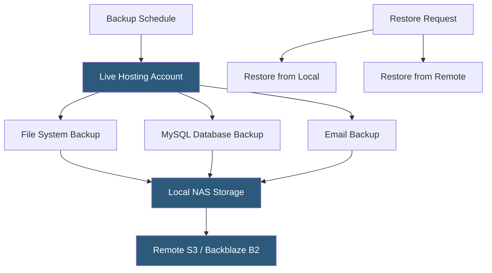

**Category:** Web Hosting Fundamentals
**Difficulty:** Intermediate
**Reading time:** 6 min read

---

Hosting backup systems create point-in-time copies of website files, databases, email, and configuration to enable recovery from accidental deletion, malware infection, or hardware failure. Effective backup strategies follow the 3-2-1 rule: three copies, two different media types, one offsite location.

- **3-2-1 backup rule** — maintain 3 copies of data on 2 different storage types with 1 offsite; minimum standard for production backups
- **Incremental backup** — copies only files changed since the last backup, reducing storage and transfer time compared to full backups
- **Differential backup** — copies all files changed since the last full backup; faster to restore than incremental but uses more storage
- **mysqldump** — command-line utility for creating portable SQL exports of MySQL/MariaDB databases; the standard backup method for database content
- **R1Soft / Idera** — commercial block-level backup platform popular in hosting; creates continuous data protection snapshots with near-zero performance impact
- **Jetpack Backup (VaultPress)** — WordPress-specific real-time backup service that records every change as it happens
- **RTO (Recovery Time Objective)** — maximum acceptable time to restore service after a failure
- **RPO (Recovery Point Objective)** — maximum acceptable data loss measured in time; a 1-hour RPO means backups must run at least hourly

A comprehensive hosting backup system operates at multiple layers. File system backups capture the full document root, configuration files, and application code. Database backups export SQL dumps of all MySQL or PostgreSQL databases. Email backups copy mailbox content (Maildir or mbox format). DNS zone backups preserve custom DNS records.

Most shared hosting panels (cPanel, Plesk) include backup tools in the control panel interface. cPanel's JetBackup integration allows users to browse file backups and restore individual files or databases without administrator intervention. The hosting provider configures backup frequency (daily or weekly), retention (7–30 days), and destination (local disk, remote FTP, or cloud storage like Amazon S3 or Backblaze B2).

R1Soft continuous data protection works differently from scheduled backups. It installs an agent on the server that monitors disk block-level changes and transmits changed blocks to a backup vault server at intervals as short as every 15 minutes. This approach achieves near-continuous backup with minimal server overhead and allows restoration to any 15-minute snapshot window within the retention period.

Database backup requires special handling for consistency. A mysqldump taken while active writes are occurring may capture partial transactions. The `--single-transaction` flag wraps the export in a transaction for InnoDB tables, ensuring a consistent snapshot without blocking writes. For large databases, Percona XtraBackup performs hot backups at the file level without locking.

Restoration testing is the most neglected aspect of backup management. A backup system that has never been tested for restoration is unreliable — corrupt backup files, incomplete mysqldumps, and misconfigured destinations are discovered only during a crisis. Quarterly restore drills to a staging environment are the minimum standard for production systems.

- Daily automated backups of all hosted accounts with 30-day retention for shared hosting providers
- Real-time backups for e-commerce sites where every transaction represents revenue
- Pre-update backups before applying WordPress core, theme, or plugin updates
- Migration backups before moving sites between hosting providers
- Disaster recovery for hacked sites requiring restoration to a clean pre-infection snapshot

| Advantage | Disadvantage |
|-----------|--------------|
| Point-in-time recovery from any backup window | Storage costs scale with retention period and site size |
| Local backups enable fast restoration (minutes) | Local-only backups vulnerable to same hardware failure |
| Offsite backups survive datacenter disasters | Offsite restoration slower due to data transfer time |
| R1Soft block-level minimizes performance impact | Continuous backup solutions add per-server licensing cost |
| User-accessible restore in cPanel reduces support tickets | Backups not regularly tested may fail when needed |

- [Staging Environment Implementation](staging-environment-implementation.md)
- [WordPress-Specific Hosting Optimization](wordpress-specific-hosting-optimization.md)
- [Website Migration Tools and Processes](website-migration-tools-and-processes.md)

---
*Part of the [Web Hosting Fundamentals](index.md) category · [Back to Master Index](../../index.md)*
