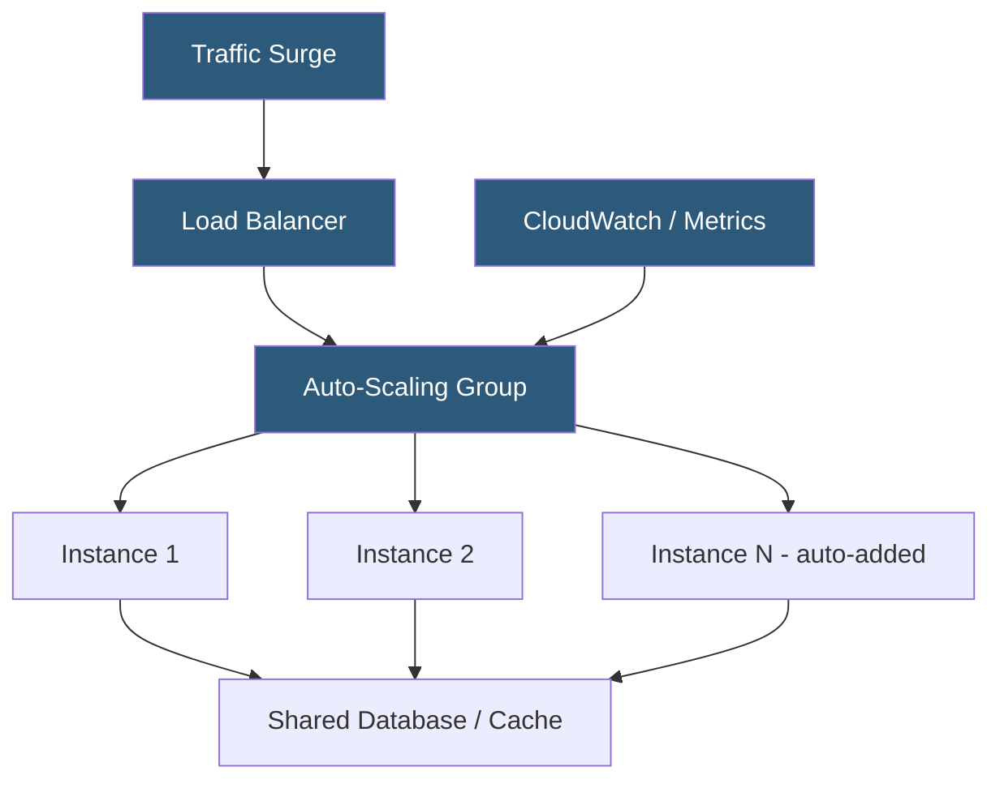

**Category:** Web Hosting Fundamentals
**Difficulty:** Intermediate
**Reading time:** 6 min read

---

Cloud hosting achieves scalability by abstracting compute, storage, and networking into elastic resource pools that can be provisioned and released programmatically. Both horizontal scaling (adding more instances) and vertical scaling (increasing instance size) are achievable without hardware procurement delays.

- **Horizontal scaling** — adding more instances to distribute load, enabling near-linear throughput increases
- **Vertical scaling** — increasing the resources (CPU, RAM) of a single instance; limited by the largest available instance type
- **Auto-scaling** — policy-driven automatic addition or removal of instances based on metrics like CPU utilization or request queue depth
- **Stateless architecture** — design pattern where server instances hold no session data, enabling any instance to serve any request
- **Load balancer** — distributes incoming traffic across healthy instances; health checks remove failed nodes automatically
- **Immutable infrastructure** — instances are never modified after deployment; changes deploy new instances replacing old ones
- **Elasticity** — the ability to scale out rapidly in response to demand spikes and scale in to reduce cost when demand falls

Cloud platforms like AWS, GCP, and Azure expose compute resources as instance types spanning a spectrum from small (1 vCPU, 1 GB RAM) to enormous (192+ vCPUs, terabytes of RAM). Instances are grouped into auto-scaling groups that monitor CloudWatch (AWS) or Stackdriver (GCP) metrics and trigger scale-out events when thresholds are breached — for example, adding an instance when average CPU exceeds 70% for five minutes.

Stateless application design is critical. If each web server instance stores session data locally, scaling out creates inconsistent experiences for users whose requests land on different instances. Solutions include externalizing session state to Redis or a managed database, or using sticky sessions at the load balancer (less scalable).

Storage scaling is handled separately. Object storage (S3, GCS) is inherently elastic. Managed databases offer read replicas for read-heavy workloads and multi-AZ deployments for availability. Block storage volumes can be resized online. CDNs push static assets to edge locations, dramatically reducing origin server load.

Cost optimization in cloud scaling relies on instance types matched to workload: compute-optimized for CPU-intensive tasks, memory-optimized for databases, spot/preemptible instances for fault-tolerant batch workloads at 60–80% discounts. Reserved instances offer 30–50% savings for predictable baseline capacity.

- E-commerce sites with seasonal traffic spikes requiring rapid capacity expansion
- SaaS applications serving global users across multiple regions
- Media processing pipelines that burst to many instances during encoding jobs
- Gaming backends handling unpredictable player concurrency
- CI/CD build farms that scale to zero during off-hours

| Advantage | Disadvantage |
|-----------|--------------|
| Pay only for resources consumed | Requires stateless architecture discipline |
| Near-instant provisioning of additional capacity | Cold start latency when scaling from zero |
| Global region availability for low-latency serving | Complexity of managing distributed state |
| No hardware procurement or maintenance | Egress bandwidth costs can be significant |
| Auto-healing replaces failed instances automatically | Cost unpredictability without spending alerts |

- [Serverless Hosting Architectures](serverless-hosting-architectures.md)
- [Container-Based Hosting Platforms](container-based-hosting-platforms.md)
- [Edge Hosting and CDN Integration](edge-hosting-and-cdn-integration.md)

---
*Part of the [Web Hosting Fundamentals](index.md) category · [Back to Master Index](../../index.md)*
