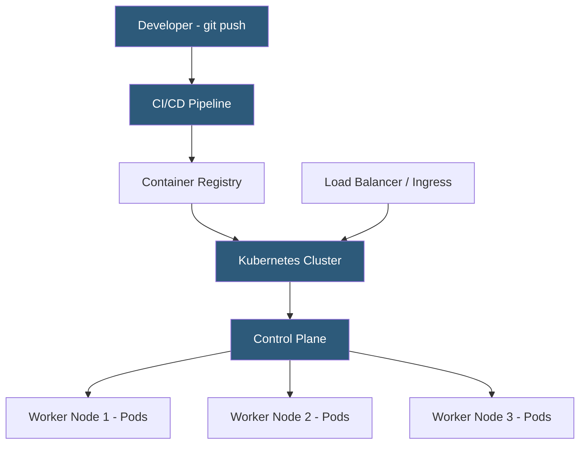

**Category:** Web Hosting Fundamentals
**Difficulty:** Intermediate
**Reading time:** 7 min read

---

Container-based hosting packages applications and their dependencies into portable images that run consistently across development, staging, and production environments. Platforms like Kubernetes, Docker Swarm, and managed container services abstract the infrastructure while providing fine-grained control over scaling, networking, and resource allocation.

- **Container image** — immutable filesystem snapshot containing the application binary, runtime, libraries, and configuration; built from a Dockerfile
- **Container runtime** — low-level software (containerd, CRI-O) that creates and runs containers from images on a host OS
- **Orchestrator** — platform (Kubernetes, Nomad) that schedules containers across a cluster, manages health checks, and handles restarts
- **Pod** — Kubernetes' basic scheduling unit; one or more containers sharing a network namespace and storage volumes
- **Namespace** — Kubernetes isolation boundary for resources; used to separate teams or environments within a cluster
- **Persistent Volume (PV)** — storage resource abstracted from the underlying infrastructure, attached to pods for stateful workloads
- **Service mesh** — infrastructure layer (Istio, Linkerd) handling container-to-container mTLS, traffic routing, and observability

Containers solve the "works on my machine" problem by packaging the application alongside its exact OS libraries, language runtime, and configuration into a reproducible image. Docker Engine or containerd on the host OS runs these images as isolated processes using Linux kernel namespaces (for process and network isolation) and cgroups (for resource limits) — lighter weight than full VMs because they share the host kernel.

In production, containers are managed by orchestrators. Kubernetes is the dominant platform. A Kubernetes cluster consists of a control plane (API server, etcd, scheduler, controller manager) and worker nodes. When a deployment is submitted, the scheduler places pods on nodes based on resource requests, affinity rules, and taints. The kubelet on each node ensures the declared pod state matches reality, restarting crashed containers automatically.

Deployments use rolling updates: new pods with the updated image are gradually created while old pods are terminated, ensuring zero downtime. Resource requests and limits declared in pod specs guarantee CPU and memory allocations. Horizontal Pod Autoscaler (HPA) scales the pod count based on CPU/memory metrics or custom metrics from Prometheus.

Managed container services (AWS ECS/EKS, Google GKE, Azure AKS) handle the control plane entirely, leaving customers to manage only worker nodes and workloads. Fully managed platforms (Google Cloud Run, AWS Fargate) abstract even the worker nodes, running containers on provider-managed infrastructure with per-request or per-second billing.

- Microservices architectures where each service runs in isolated containers
- Multi-environment consistency: same image runs in dev, staging, and production
- Blue/green and canary deployments with traffic splitting between versions
- Batch processing workloads with job queues and parallel worker scaling
- Machine learning model serving with GPU-attached pods

| Advantage | Disadvantage |
|-----------|--------------|
| Consistent environments eliminate configuration drift | Kubernetes has a steep learning curve |
| Fine-grained resource allocation per service | Cluster management overhead for small teams |
| Rolling deployments enable zero-downtime releases | Stateful workloads (databases) complex to containerize |
| Container images are immutable and auditable | Image build and registry management adds CI/CD complexity |
| Strong ecosystem of tools and community support | Networking model requires understanding of CNI plugins |

- [Cloud Hosting Scalability Principles](cloud-hosting-scalability-principles.md)
- [Serverless Hosting Architectures](serverless-hosting-architectures.md)
- [Development vs Production Hosting Separation](development-vs-production-hosting-separation.md)

---
*Part of the [Web Hosting Fundamentals](index.md) category · [Back to Master Index](../../index.md)*
