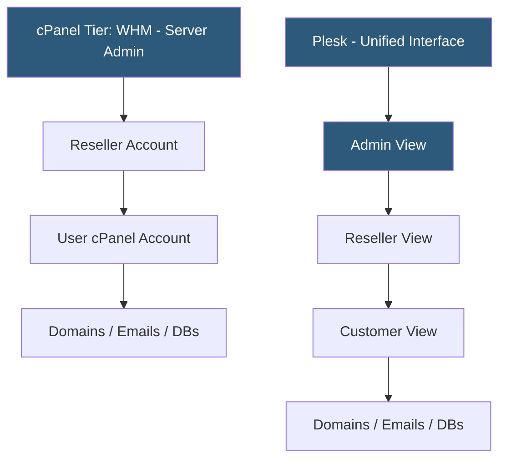

**Category:** Web Hosting Fundamentals
**Difficulty:** Beginner
**Reading time:** 6 min read

---

cPanel and Plesk are the two dominant web hosting control panels, providing graphical interfaces for managing websites, databases, email accounts, DNS, and SSL certificates. cPanel is the long-standing standard in the shared hosting industry; Plesk supports both Linux and Windows servers and is popular in European and enterprise markets.

- **cPanel** — Linux-only control panel with a three-tier architecture: root server access via WHM, reseller management, and end-user cPanel interface
- **Plesk** — cross-platform control panel running on Linux and Windows; uses a single unified interface with role-based permissions
- **WHM (Web Host Manager)** — cPanel's server administration layer above the customer cPanel interface, used by hosting providers
- **DNS zone editor** — control panel feature for managing A, CNAME, MX, TXT, and other DNS records for hosted domains
- **AutoSSL** — cPanel's built-in Let's Encrypt integration that automatically issues and renews free SSL certificates for all hosted domains
- **Softaculous** — one-click application installer integrated into both cPanel and Plesk supporting 400+ apps including WordPress, Joomla, Drupal
- **PHP selector** — CloudLinux feature exposed in both panels allowing users to choose PHP version per domain independently

cPanel operates on a strict three-tier model. At the top, WHM (Web Host Manager) provides root-level server administration: creating hosting packages, setting resource limits, managing server software, and viewing server health. The middle tier handles reseller accounts that can create and manage end-user cPanel accounts within their allocation. The bottom tier is the familiar cPanel interface that end users interact with to manage their websites, email accounts, FTP users, MySQL databases, and domain DNS settings.

Plesk's architecture is more flexible. A single web-based interface adjusts its available options based on the logged-in user's role (administrator, reseller, customer). This makes Plesk feel more streamlined for users who don't need the strict separation of cPanel's tier model. Plesk's Docker, Git, and Node.js integrations make it more developer-friendly for non-traditional hosting workflows.

Both panels support Let's Encrypt SSL certificates automatically. cPanel's AutoSSL runs daily and renews certificates before expiration. Plesk's SSL/TLS wizard handles both Let's Encrypt and paid certificate installation.

Email management in both panels covers creating mailboxes, setting quotas, configuring SPF/DKIM/DMARC records, and setting up forwarders and autoresponders. cPanel uses Exim as its MTA with SpamAssassin; Plesk supports Postfix or Qmail.

Licensing differs significantly: cPanel moved to per-account pricing in 2019, making it expensive for providers with large account counts. Plesk uses per-server licensing tiers, which can be more economical at scale.

- Shared hosting providers standardizing on cPanel for maximum customer familiarity
- European hosting companies preferring Plesk for Windows server compatibility
- Windows-based hosting (ASP.NET sites) requiring Plesk since cPanel is Linux-only
- Developers wanting Git and Docker integration via Plesk's extension ecosystem
- Resellers building hosting businesses on the WHM/cPanel platform

| Advantage | Disadvantage |
|-----------|--------------|
| cPanel: largest user base, widest documentation | cPanel: Linux-only, no Windows support |
| Plesk: runs on Linux and Windows | Plesk: less dominant in shared hosting market |
| Both: AutoSSL/Let's Encrypt integration | cPanel: per-account pricing expensive at scale |
| Both: Softaculous one-click installers | Both: vendor lock-in to proprietary management tools |
| Plesk: developer-friendly Docker/Git extensions | cPanel: WHM complexity curve for new administrators |

- [WHM Web Host Manager Automation](whm-web-host-manager-automation.md)
- [One-Click Application Installers](one-click-application-installers.md)
- [Managed vs Unmanaged Hosting Services](managed-vs-unmanaged-hosting-services.md)

---
*Part of the [Web Hosting Fundamentals](index.md) category · [Back to Master Index](../../index.md)*
