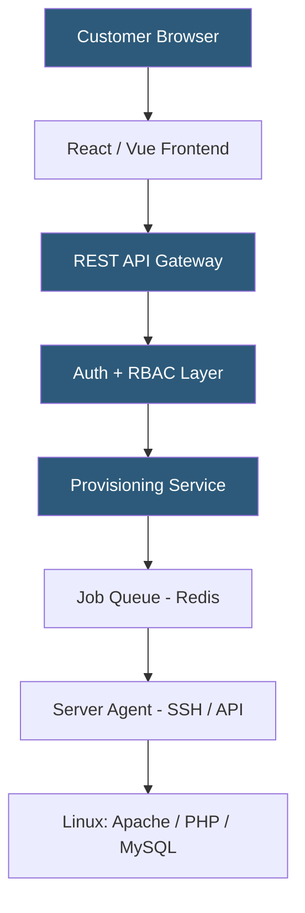

**Category:** Web Hosting Fundamentals
**Difficulty:** Advanced
**Reading time:** 7 min read

---

Custom control panels are purpose-built web interfaces for hosting management, built when commercial panels don't meet specific requirements around branding, feature set, or integration. They interface with server APIs (cPanel API, ISPConfig, Virtualmin) or directly with system services to provide tailored hosting management experiences.

- **Provisioning API** — backend API that translates control panel actions into system-level operations: creating Linux users, configuring virtual hosts, provisioning databases
- **Infrastructure abstraction layer** — middleware that decouples the control panel logic from specific server technologies, enabling multiple backend providers
- **Role-based access control (RBAC)** — permission system defining what each user role (admin, reseller, customer) can view and modify
- **Webhook events** — notifications pushed to external systems when provisioning events occur; enables WHMCS integration without polling
- **Job queue** — asynchronous task system (Redis Queue, Celery) handling long-running operations like account creation, backups, and software installation
- **Audit log** — immutable record of all user actions and system changes; critical for security investigation and compliance
- **API gateway** — rate-limiting, authentication, and routing layer in front of the provisioning API

Building a custom control panel requires solving several non-trivial engineering problems simultaneously. The frontend provides the user interface — typically a React or Vue SPA communicating with a backend API. The backend translates user actions into server operations, manages authentication and permissions, and maintains state about accounts, domains, and configurations.

Server communication is the most critical component. The provisioning service connects to hosting servers via SSH (using Paramiko in Python or ssh2 in Node.js) or through server-specific APIs (Virtualmin's remote API, ISPConfig's SOAP API). Each hosting action — creating a domain, provisioning a database, updating DNS — translates into specific commands or API calls executed on the server.

Asynchronous execution is essential. Server operations can take seconds or minutes; synchronous HTTP requests that block waiting for them produce poor user experience and timeout errors. A job queue (Sidekiq, Bull, Celery) receives provisioning tasks from the API, executes them on background workers, and notifies the frontend via WebSocket when complete.

Database design must track the full state of every provisioned resource: accounts, domains, email boxes, databases, SSL certificates, and DNS zones. This state is the source of truth that enables idempotent provisioning (retrying a failed creation without duplicating resources) and consistent billing data.

Security is particularly challenging in a custom panel: the provisioning service has elevated server access (often root or a privileged system account), making it a high-value attack target. Input sanitization, parameterized commands (never string concatenation for SSH commands), audit logging, and rate limiting are non-negotiable.

- Large hosting providers with hundreds of thousands of accounts requiring proprietary workflows
- Managed WordPress platforms with hosting-specific features not available in generic panels
- Enterprise self-service portals integrating hosting with internal IT service management
- Multi-cloud hosting panels abstracting AWS, GCP, and Azure infrastructure behind a unified UI
- ISPs offering hosting as a bundled service integrated with their existing customer billing systems

| Advantage | Disadvantage |
|-----------|--------------|
| Complete control over features and UX | Significant development investment (months to years) |
| Deep integration with existing business systems | Ongoing maintenance burden for security and features |
| No per-account licensing fees | Security vulnerabilities in provisioning layer are critical |
| Differentiates product from commodity hosting | Users unfamiliar with non-standard interface |
| Can support non-standard hosting architectures | Requires specialized developer expertise |

- [WHM Web Host Manager Automation](whm-web-host-manager-automation.md)
- [Hosting Account Provisioning Automation](hosting-account-provisioning-automation.md)
- [cPanel vs Plesk Control Panel Comparison](cpanel-vs-plesk-control-panel-comparison.md)

---
*Part of the [Web Hosting Fundamentals](index.md) category · [Back to Master Index](../../index.md)*
