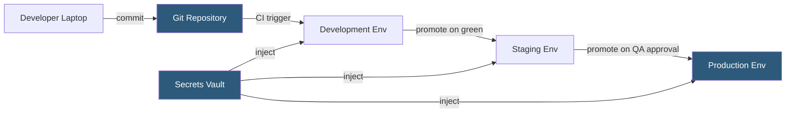

**Category:** Web Hosting Fundamentals
**Difficulty:** Intermediate
**Reading time:** 6 min read

---

Separating development, staging, and production hosting environments enforces a deliberate promotion path that minimizes risk. Each environment serves a distinct audience — developer, QA, and end user — and carries different configuration, data, and access controls. Collapsing these environments onto one server is a common source of data loss, security breaches, and difficult-to-reproduce bugs.

- **Environment** — a configured instance of the application stack serving a specific purpose (dev/staging/prod)
- **Environment variable** — runtime configuration value injected per environment to vary behavior without code changes
- **Twelve-Factor App** — methodology prescribing strict environment separation via config, not code
- **Dev/prod parity** — minimizing differences between environments to catch issues earlier
- **Secrets management** — storing credentials in vaults or environment variables rather than source code
- **Promotion** — moving a tested artifact from a lower environment to a higher one
- **Configuration drift** — unintentional differences between environments that cause environment-specific failures
- **Immutable infrastructure** — deploying fresh server images rather than patching running servers

At the development level, engineers run a local stack or a shared dev server with debug logging enabled, error display on, and test data. Configuration is loaded from a `.env.development` file or a local override that is never committed to source control. Mocked payment gateways, sandbox API keys, and seeded fake user accounts let developers work freely without affecting real services.

The staging environment receives the same artifact — a Docker image, a Git tag, or a compiled release archive — that will eventually go to production. It uses production-equivalent infrastructure (same server tier, same database version) but connects to non-production API sandboxes. A sanitized copy of the production database is refreshed periodically to provide realistic query patterns.

Production is the highest-trust environment. Changes arrive only through the automated promotion pipeline, never through manual SSH edits. Feature flags, canary deployments, and blue-green switches allow incremental rollouts, enabling rapid rollback if metrics degrade. Production credentials are stored in a secrets manager (HashiCorp Vault, AWS Secrets Manager, or equivalent) and injected at runtime — never stored in configuration files or repositories.

Strict RBAC on each environment ensures that developers have write access to dev, limited access to staging, and read-only or emergency-only access to production.

- Preventing accidental email sends to real customers from test scripts
- Running database schema migrations safely before applying to production tables
- Load-testing new infrastructure sizing against production-mirrored data
- Auditing deployments for compliance without exposing production access
- Rolling out new features to internal users before general availability

| Advantage | Disadvantage |
|-----------|--------------|
| Isolates failures to non-production environments | Higher infrastructure costs for multiple environments |
| Enables independent testing of each change | Configuration drift between environments causes subtle bugs |
| Protects production data from test contamination | Promotion pipelines require upfront investment to build |
| Clear audit trail of what was tested before release | Developers may work around restrictions under deadline pressure |

- [Staging Environment Implementation](staging-environment-implementation.md)
- [Git Integration for Hosting Platforms](git-integration-for-hosting-platforms.md)
- [Local Development Environment Setup](local-development-environment-setup.md)

---
*Part of the [Web Hosting Fundamentals](index.md) category · [Back to Master Index](../../index.md)*
