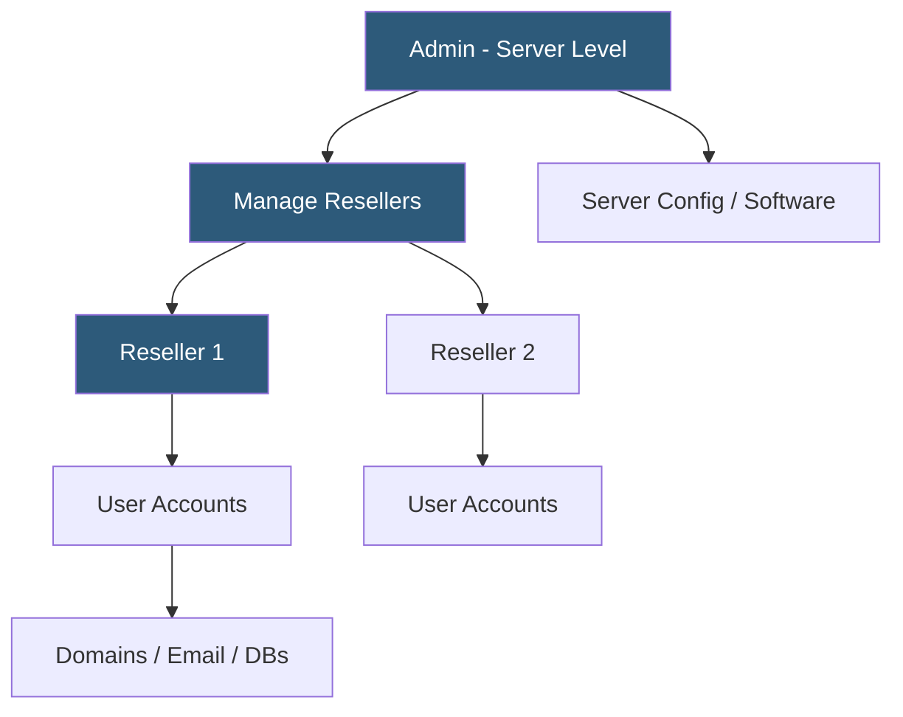

**Category:** Web Hosting Fundamentals
**Difficulty:** Beginner
**Reading time:** 5 min read

---

DirectAdmin is a lightweight, fast web hosting control panel for Linux servers offering three-tier account management (admin, reseller, user) at significantly lower licensing cost than cPanel. Its minimal resource footprint and simple interface make it popular with budget hosting providers and VPS operators.

- **Three-tier hierarchy** — admin manages the server, resellers create and manage user accounts, users manage their own sites
- **Skin system** — DirectAdmin supports multiple UI themes (Evolution, Enhanced) that completely change the interface appearance
- **CustomBuild** — DirectAdmin's integrated compilation and installation system for Apache, PHP, MySQL, and related software
- **Reseller package** — configurable resource bundle (disk space, bandwidth, number of user accounts) assigned to reseller accounts
- **API token** — DirectAdmin's authentication mechanism for API access; supports user-level and admin-level tokens with scoped permissions
- **Plugin system** — extensible architecture allowing third-party plugins to add features (Softaculous, CSF firewall integration, Imunify360)
- **Message system** — built-in notification and support ticket messaging between admin, resellers, and users

DirectAdmin was designed from the ground up for performance and low resource usage. The control panel daemon itself consumes minimal memory (under 50 MB), making it suitable for running on VPS instances with as little as 512 MB RAM — a significant advantage over cPanel which requires several gigabytes of RAM for comfortable operation.

The Evolution skin (introduced in 2019) provides a modern responsive interface accessible on mobile devices. The older Enhanced skin is still available and preferred by some administrators for its density of information. Skin selection is per-user, so resellers and customers can independently choose their preferred interface.

Software installation and management is handled through CustomBuild 2.0. Administrators select which software stack to install (Apache vs Nginx, PHP versions, MySQL vs MariaDB) and CustomBuild compiles or installs packages accordingly. Multiple PHP versions can coexist; users can select their PHP version through the PHP selector interface.

The DirectAdmin API is REST-based, accepting form-encoded parameters and returning JSON responses. Account operations (create, modify, suspend, delete) are straightforward. WHMCS and other billing platforms have DirectAdmin provisioning modules, enabling the same automated lifecycle management available with cPanel.

DirectAdmin's licensing model is simpler and cheaper than cPanel: flat monthly per-server pricing regardless of account count. This makes it economically attractive for providers with large numbers of small accounts. Resellers appreciate the low-cost entry point for building hosting businesses without the per-account cPanel pricing impact.

- Budget hosting providers seeking lower control panel licensing costs than cPanel
- VPS providers offering managed hosting on resource-constrained instances
- Resellers building hosting businesses with thin margins requiring cost management
- Developers self-hosting projects on a VPS with a friendly management interface
- Hosting providers in price-competitive markets (India, Eastern Europe) where cPanel licensing is prohibitive

| Advantage | Disadvantage |
|-----------|--------------|
| Significantly lower licensing cost than cPanel | Smaller ecosystem and user community than cPanel |
| Low memory footprint suitable for small VPS | Some advanced features require cPanel equivalent plugin purchase |
| Simple three-tier model easy to understand | Less documentation and community resources available |
| CustomBuild handles software updates efficiently | Migration from cPanel requires manual work |
| Flat per-server pricing regardless of account count | Some third-party integrations prefer cPanel over DirectAdmin |

- [cPanel vs Plesk Control Panel Comparison](cpanel-vs-plesk-control-panel-comparison.md)
- [Custom Control Panel Development](custom-control-panel-development.md)
- [Reseller Hosting Business Models](reseller-hosting-business-models.md)

---
*Part of the [Web Hosting Fundamentals](index.md) category · [Back to Master Index](../../index.md)*
