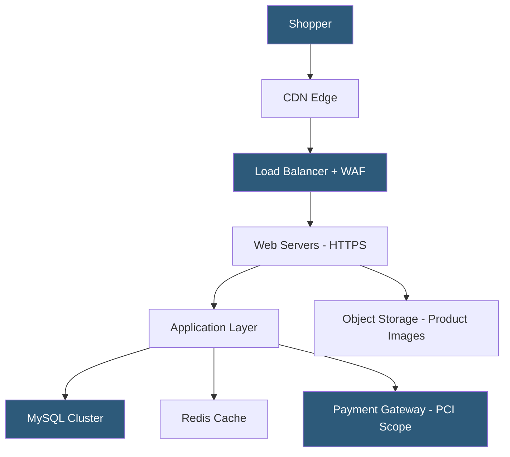

**Category:** Web Hosting Fundamentals
**Difficulty:** Intermediate
**Reading time:** 6 min read

---

E-commerce hosting must satisfy demands beyond standard web hosting: PCI-DSS compliance for payment processing, high availability to prevent revenue loss from downtime, SSL/TLS encryption across all pages, and database performance capable of handling inventory queries and order transactions concurrently.

- **PCI-DSS** — Payment Card Industry Data Security Standard; 12 requirements governing how cardholder data is stored, transmitted, and protected
- **SSL/TLS** — encrypted HTTPS connections mandatory for all checkout and account pages; affects SEO rankings and browser trust indicators
- **Dedicated IP address** — often required for SSL certificates and improved email deliverability for order confirmation emails
- **High availability** — redundant infrastructure ensuring the store remains accessible during hardware failures or traffic spikes
- **CDN for e-commerce** — content delivery network that serves product images and static assets from edge locations near shoppers
- **Database transactions** — ACID-compliant MySQL/PostgreSQL transactions ensuring order records are consistent even under concurrent writes
- **PCI scope reduction** — architecture patterns (hosted payment pages, tokenization) that minimize which systems must comply with PCI-DSS

An e-commerce store has fundamentally different risk and performance profiles compared to an informational website. A one-second delay in page load time reduces conversions by approximately 7%, making performance a direct revenue metric. Server downtime during peak periods (Black Friday, product launches) translates to quantifiable lost sales.

PCI-DSS compliance governs the technical environment when cardholder data is processed or stored. Scope reduction is the primary architecture goal: by redirecting shoppers to a hosted payment page (Stripe, Braintree, PayPal Checkout) or using JavaScript-based card tokenization, the merchant's servers never touch raw card numbers. This reduces PCI scope from SAQ D (comprehensive, 300+ controls) to SAQ A (minimal, self-assessment only).

Database performance requires careful schema design. Product catalog queries (browsing, search, filtering) are read-heavy and benefit from query caching and read replicas. Order processing involves write transactions that must be ACID-compliant to prevent inventory overselling. Applications like WooCommerce and Magento use row-level locking and transaction isolation levels to handle concurrent checkout attempts on the same SKU.

Dedicated server or cloud instances with NVMe storage are preferred over shared hosting for stores with meaningful transaction volume. Session management for shopping carts requires either sticky sessions or externalizing cart state to Redis to support horizontal scaling.

WAF (Web Application Firewall) rules specifically addressing e-commerce threats — credential stuffing on login pages, card testing bots, inventory hoarding bots — are a hosting-level defense layer beyond standard security.

- Online retail stores requiring PCI-compliant payment processing environments
- Marketplace platforms with multiple vendors and high concurrent product queries
- Subscription commerce sites with recurring billing and customer account management
- Flash-sale sites requiring rapid scale-out for short traffic bursts
- B2B order portals requiring authenticated, personalized catalog and pricing display

| Advantage | Disadvantage |
|-----------|--------------|
| PCI-DSS compliant environments reduce audit burden | Higher cost than generic hosting |
| High-availability setup prevents revenue loss | Complexity of compliance audits and documentation |
| CDN reduces image load times globally | Requires ongoing security monitoring |
| Dedicated resources prevent noisy-neighbor effects | HTTPS and certificate management overhead |
| Staging environments allow safe testing | Database transactions add latency vs. eventual consistency |

- [Cloud Hosting Scalability Principles](cloud-hosting-scalability-principles.md)
- [Multi-Tenant Hosting Security](multi-tenant-hosting-security.md)
- [Static Site Hosting Solutions](static-site-hosting-solutions.md)

---
*Part of the [Web Hosting Fundamentals](index.md) category · [Back to Master Index](../../index.md)*
