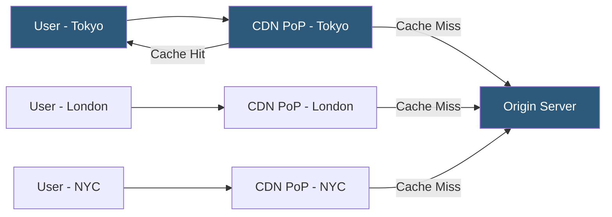

**Category:** Web Hosting Fundamentals
**Difficulty:** Intermediate
**Reading time:** 6 min read

---

Edge hosting places compute and cached content at geographically distributed Points of Presence (PoPs) close to end users, reducing round-trip latency from hundreds of milliseconds to single digits. CDN integration layers caching, DDoS mitigation, and edge compute on top of origin servers to improve performance globally.

- **Point of Presence (PoP)** — a CDN data center location housing servers that cache content and serve users in that geographic region
- **Anycast routing** — network technique where multiple servers share a single IP address; DNS resolves to the topologically nearest PoP
- **Cache-Control headers** — HTTP directives (max-age, s-maxage, no-cache) that tell CDN edge nodes how long to cache a response
- **Cache hit ratio** — percentage of requests served from CDN cache without reaching the origin; higher ratios reduce origin load
- **Origin pull** — CDN fetches a resource from the origin server when no cached copy exists or the cache has expired
- **Edge compute** — code execution at CDN PoPs (Cloudflare Workers, Lambda@Edge, Fastly Compute) before requests reach origin
- **Stale-while-revalidate** — CDN serves an expired cached response immediately while fetching a fresh copy in the background

A CDN operator (Cloudflare, Fastly, Akamai, AWS CloudFront) maintains dozens to thousands of PoPs connected by private backbone networks. When a domain is placed behind a CDN, the domain's DNS records are updated to point at the CDN's anycast IP space instead of directly at the origin server. The CDN's Anycast routing directs each user's requests to their nearest PoP.

When a PoP receives a request, it checks its cache for a matching URL. On a cache hit, the file is returned from local SSD storage without contacting the origin. On a cache miss, the PoP forwards the request to the origin, stores the response according to Cache-Control headers, and returns it to the user. Subsequent requests from anywhere in that PoP's region receive the cached version.

Cache-Control headers govern behavior: `Cache-Control: public, max-age=86400` tells the CDN to cache a response for 24 hours. `s-maxage` overrides `max-age` specifically for shared caches (CDN edges) while keeping a shorter browser cache. Dynamic pages often use `Cache-Control: private, no-store` to prevent CDN caching of personalized content.

Edge compute extends CDN capability from pure caching to request processing. Cloudflare Workers run JavaScript at PoP level, enabling A/B testing, authentication checks, URL redirects, request/response modification, and API aggregation — all without round-tripping to the origin. This cuts latency for these operations from 100–500ms to 5–20ms.

Purging cached content when origin data changes is handled via CDN API calls that invalidate URLs, cache tags, or entire paths. Cache tag-based purging (supported by Cloudflare, Fastly) allows precise invalidation of all cached responses related to a specific content object.

- Global product websites requiring fast load times for users on all continents
- Media streaming platforms serving large video files from geographically distributed caches
- News sites using cache-tag purging for instant article update propagation
- DDoS mitigation by absorbing volumetric attacks at the CDN edge before reaching origin
- Edge personalization using Worker scripts to customize responses by country or device type

| Advantage | Disadvantage |
|-----------|--------------|
| Sub-50ms TTFB for cached content globally | Cache invalidation complexity for dynamic sites |
| Massive DDoS absorption capacity at edge | CDN costs scale with bandwidth usage |
| Origin server load reduced dramatically | Cache misconfiguration can serve stale content |
| Edge compute reduces round-trip latency | Debugging edge logic harder than server-side code |
| Built-in SSL/TLS termination at edge | Vendor lock-in to edge compute APIs |

- [Static Site Hosting Solutions](static-site-hosting-solutions.md)
- [Cloud Hosting Scalability Principles](cloud-hosting-scalability-principles.md)
- [Serverless Hosting Architectures](serverless-hosting-architectures.md)

---
*Part of the [Web Hosting Fundamentals](index.md) category · [Back to Master Index](../../index.md)*
