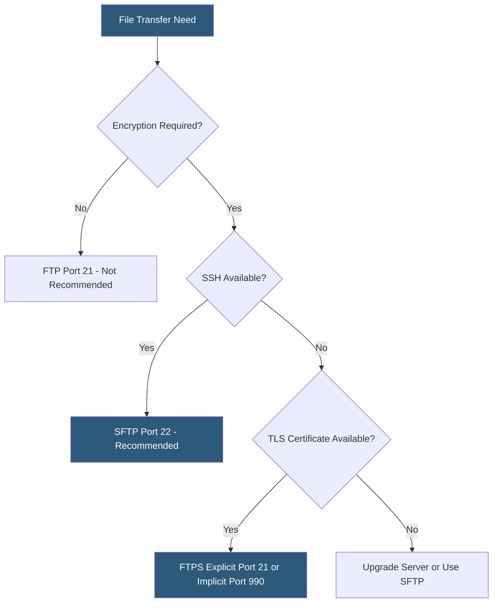

**Category:** Web Hosting Fundamentals
**Difficulty:** Beginner
**Reading time:** 5 min read

---

FTP, SFTP, and FTPS are three file transfer protocols used to upload and manage website files on hosting servers. FTP is the original unencrypted protocol, FTPS adds SSL/TLS to FTP, and SFTP is a completely separate SSH-based protocol despite its similar name. Security requirements and firewall configurations determine which protocol is appropriate for a given hosting environment.

- **FTP (File Transfer Protocol)** — original 1971 protocol transmitting data and credentials in cleartext over port 21
- **FTPS (FTP Secure)** — FTP extended with SSL/TLS encryption; uses explicit or implicit mode on ports 21 or 990
- **SFTP (SSH File Transfer Protocol)** — subsystem of SSH, not related to FTP; encrypted file transfer over port 22
- **Active mode** — FTP mode where the server initiates the data connection back to the client
- **Passive mode** — FTP mode where the client initiates both control and data connections, firewall-friendly
- **Explicit FTPS** — client upgrades a plain FTP connection to TLS using the `AUTH TLS` command
- **Implicit FTPS** — TLS is assumed from connection start on port 990, no upgrade negotiation needed
- **SCP (Secure Copy Protocol)** — simpler SSH-based file copy command, a complement to SFTP

Plain FTP uses two TCP channels: a control connection on port 21 for commands and a separate data connection for file transfers. Both channels transmit in cleartext, making credentials and file contents visible to network eavesdroppers. In active mode, the server opens the data connection back to the client's high port, which is blocked by most NAT firewalls. Passive mode solves this by having the client open the data connection to a server-specified high port, making it router-friendly.

FTPS wraps FTP in TLS. In explicit mode (FTPES), the client connects to port 21 and issues `AUTH TLS` to negotiate encryption before sending credentials — the server can allow or require this upgrade. In implicit mode, TLS is assumed from the first byte and requires port 990. Both FTPS modes still require a range of open high ports for passive data connections, complicating firewall rules.

SFTP is architecturally unrelated to FTP. It runs as an SSH subsystem over port 22, using a single encrypted connection for both commands and data. Authentication can use username/password or, preferably, SSH public key pairs. SFTP supports atomic rename operations, symbolic links, and fine-grained permission queries. It is the recommended choice for all new deployments because it uses a single port, requires no additional firewall rules beyond SSH, and provides strong encryption with modern cipher suites.

FileZilla, Cyberduck, and WinSCP are common GUI clients supporting all three protocols.

- Deploying website files to shared hosting accounts
- Transferring database export files to a remote backup location
- Providing third-party agencies with scoped file access to a hosting account
- Automated scripts uploading log files or reports to a remote server
- Legacy systems that only support FTP requiring a gateway translation layer

| Advantage | Disadvantage |
|-----------|--------------|
| FTP: universally supported, easy to debug | FTP: no encryption, credentials exposed on the network |
| SFTP: single port, strong encryption, key auth | SFTP: requires SSH daemon access, not always on shared hosts |
| FTPS: adds TLS to existing FTP infrastructure | FTPS: multiple ports needed, complex firewall configuration |
| All protocols supported by major GUI clients | FTP/FTPS being deprecated by many modern hosts |

- [SSH Access Management for Shared Hosting](ssh-access-management-for-shared-hosting.md)
- [WebDAV for File Management](webdav-for-file-management.md)
- [Website Migration Tools and Processes](website-migration-tools-and-processes.md)

---
*Part of the [Web Hosting Fundamentals](index.md) category · [Back to Master Index](../../index.md)*
